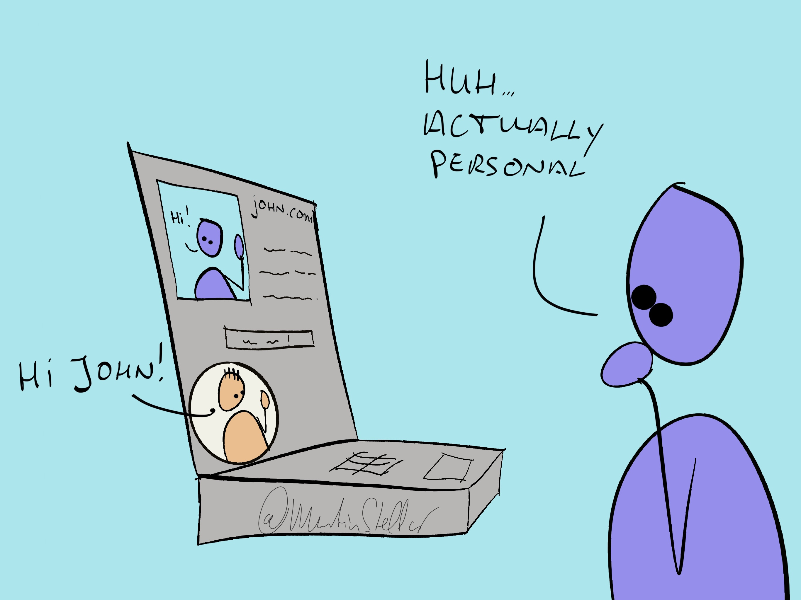

It's the fashionable thing to do these days:

Get a couple of software subscriptions for scraping & sourcing a list of leads, for writing outreach copy using AI, and for automatically sending sequences of messages to people by email or LinkedIn.

And then you end up sending such gems as "Hey Martin, love your work. We should talk because I have this system that can reliably bring in dozens of highly qualified leads each month!".

Uhuh. I'm sure you do.

But I suppose you're going to generate those leads by running the same automated campaign and funnel, that you're running on me, right?

Yeah about that:

I don't like being in that kind of funnel, and I sure as hell don't want to put my buyers into one.

Sure I have a sales funnel, and databases of leads, and a lead generation process - but you'll never see me spam people on LinkedIn, hoping that 1 in 1000 will reply.

No, I get personal, I study people, I do my homework on them - and THEN, to a small set of manually selected people, I send a personal message.

Not "personalised" - those cheesy images where they're holding a coffee-mug with your name super-imposed on it, or those stupid emails that an AI wrote based on some keywords in your LinkedIn bio.

No, an actually personal message, talking about them and what they show on the internet about their business, and why I think we should talk. Most of the time, I'll even record a 60-second video with screengrab, so they see me navigating their site, commenting on what I see, and they can't possibly ignore the fact that as far as Martin's outreach goes it's actually, literally, personal. The proof is right there, talking to them.

And, I prove that I've invested time in them, that I've spent time looking at their stuff, that they are worth my time.

That combo, of personal messaging and the proof that you've invested time in them, works magic on people.

Not only does it get me sales conversations and sales, I also receive fun replies like "I didn't know I wanted stone-cold outreach today, but this rocks, thank you for taking the time". Both of which to say:

When you do it right, people *like* cold outreach, and you bet that helps your sales.

Sure, it's a costly process, to manually review people and create personal messages.

But the upshot is a much higher percentage of replies, and far more calls with the right people, i.e. much less wasted time talking to tire-kickers and wantrepreneurs, and far fewer exploration calls fall flat for lack of fit.

Bonus: I get to have less clutter in my pipeline, so actually working on my CRM and updating deals and following up with people is much easier and much more fun. Which makes it all the more easier to answer the question "[[📄 Any leads in your pipeline?|📄 Any leads in your pipeline]], Martin?"

And the best of it: I feel better about the way I spend my time, because I have fewer calls but of higher quality.

Buying automation is tempting, but a pipeline full of bad deals means you pay a time-tax on that time-saving automation, with every failed call you have later on.

I prefer paying the cost up-front, by studying people and getting on calls with the right ones - and so do they.
