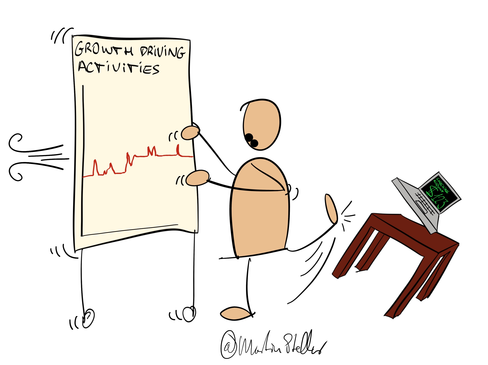

Everybody has dreams. Results we want to create. A lifestyle, and an economy, that we work towards.

The results of those efforts show up in things you can measure, like the amount of free time you have, or the number of dollars coming in or stacked in the bank.

Between those metrics and the effort needed to create them, there’s delay and lag, there's a gap.

Depending on what you're building and the goals that you have, that can be weeks, months, or years.

Now if you pay a lot of attention to the lagging indicators (how much free time or money you have, or the number of customers or sales or money etc etc), it’s very easy to get disheartened.

Growth usually starts slow, a nearly flat line for months, or even years, until it suddenly sweeps upward.

That happens when you reach the tipping point, and the flattish line suddenly gets that nice hockeystick shape we would all like to see in our bank accounts.

Until you get to that point though, you really want to avoid looking at the results too much.

Meaning: ignore the lagging indicators, and focus instead on the leading indicators: those actions that will, eventually, bring you to the tipping point.

Look; measure; plan; schedule - get serious, scientific, monastic and scholarly on that stuff, and become a veritable pro at executing in deep focus, on the activities - which are leading indicators - that will lead you to the tipping point as fast as can.

Create those blocks of single-pointed attention, to work on those growth-driving activities, and keep executing. Whether that’s an hour a day, or a 5-day bout in an AirBnB each month depends on what works for you.

But do that important work, and measure how much of it you do. Measure tasks checked off. Reflect on and measure how focussed and productive you were. Journal so as to find ways to optimise your output in those blocks.

Keep chipping away at the leading metrics, while basically ignoring the lag metrics.

Those will show up, but ONLY if you doggedly execute on the leading metrics.
