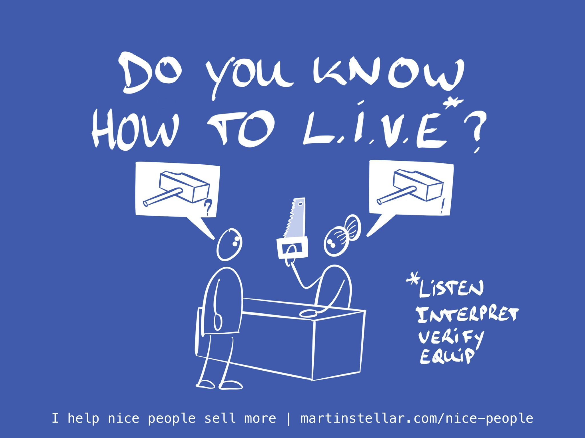

Super frustrating, when a buyer seems keen and ready, but then they end up not buying.
And very often it’s because you skipped over a fundamental, essential, crucial step in the sales process: verification.

What tends to happen is: they talk, you listen, you interpret their words and their needs... and usually, we then directly go into provisioning our solution. 

Our good ideas, our offer, our solution: "Oh let me tell you how we can help with that!"

Or, in the context of the L.I.V.E. model: you move straight into 'Equipping' your buyer with your solution, presenting them with the option to get their problem fixed.

But if you don't first **Verify** that you understood their case and their need correctly, [[📄 How to ruin a sale by being helpful|it's very easy to miss the mark...]]

And then the buyer doesn't feel like you're getting them, or they feel that something is missing, or they're stuck with a concern that hasn't been addressed yet... and so they don't proceed to buy.

To prevent that from happening, apply the L.I.V.E. model when dealing with buyers for your consulting or coaching services.

Four simple steps:
> ### How to L.I.V.E.
> 1. Listen
> 2. Interpret
> 3. Verify
> 4. Equip

Where point \#3, Verify, is the thing you should never skip.

A useful - if innocent - illustration of how things can go wrong when you don't verify happens here in town, in my local hardware store.

The lady who works there is really nice, super helpful. 

But, in trying to be helpful, she nearly always moves too fast.

She gets my request wrong, goes to the back, and comes out with something other than what I’m looking to buy.

It’s no big deal, but practically every time I need something, she has to return to the back and go pick out the thing that I did ask for.

At first, I thought: “She just doesn’t listen”.

But that’s not it.

What's actually going on dawned on me the other day, when she said:

“Oh I thought you wanted XYZ”.

See, it’s not that she doesn’t listen - she simply doesn’t stop to Verify that we're talking about the same thing.

She Interprets and straight away moves into trying to Equip me with whatever washer or wrench she thinks I need.

Again, nothing against her - I like that she’s trying to help and think along with me.

But she could make the process so much better for herself, and save herself the trouble of going back to the back of the store, if she’d simply ask:

“So you want an XYZ in that size?”

Then I could either say yes, or: “No, the other thing/size/colour”.

For you in your sales process, this is an extremely important thing to remember.

Because there are countless points in the sales process where you Interpret people’s statements.

But if you then don’t Verify that you got it right, you keep giving your buyer the sensation that you’re not quite getting them.

And with each instance of that happening, your buyer is less bought-in to what you’re trying to say, offer, or have them buy.

And so, the sale breaks.

So remember the L.I.V.E. model:

1. Listen to what they’re saying.
2. Interpret and compute.
3. Verify that you got it right.
4. And only when your buyer confirms that you do have it right, do you offer to equip them with your solution.

It’s really simple, too:

“So you’re saying that you want XYZ…?”

“Do I have this right, you’re looking for…?”

“Tell me if I’m wrong, but do you mean that…?”

"Just so I get the complete picture, does that mean...?"

This way, you invite the buyer to correct you, so that you can calibrate whatever you’ll say next - calibrate it to reflect, and **address exactly what they wanted you to hear.**

Verify what you think you heard, instead of running with it and missing the mark. 

