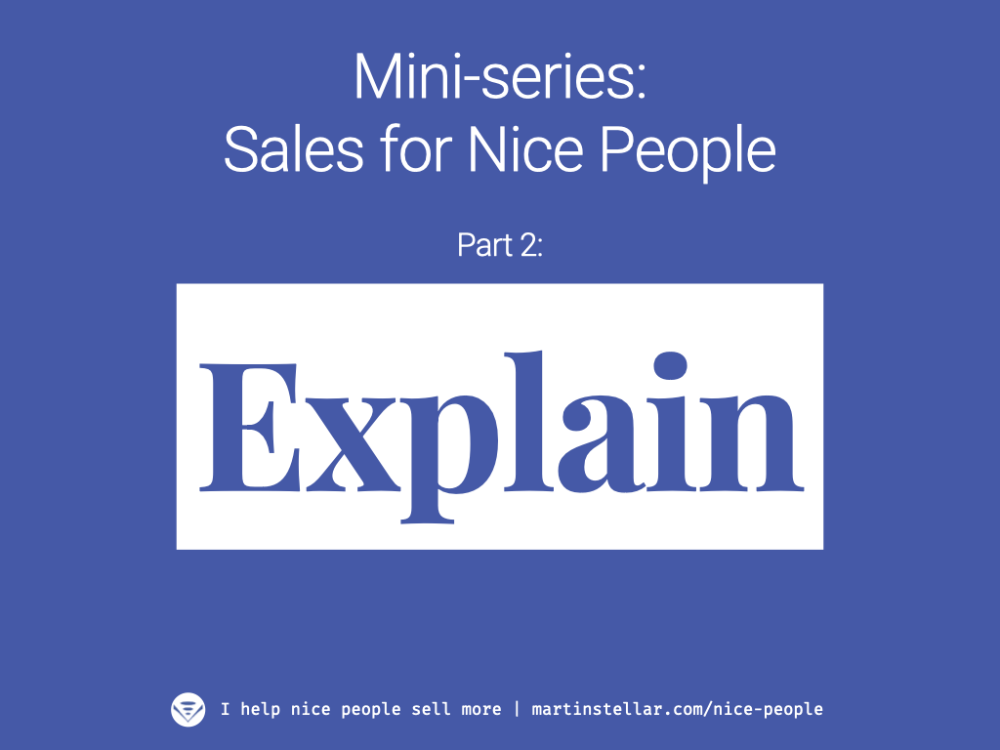

---
tags:
  - Articles
pubDate: 2024-07-10
type: sfcContent
location: 
cdate: 2024-07-10 Wed
episode: 
podStatus: Published
imagePath: Media/SalesFlowCoach.app_Sales-for-nice-people-2-Explain_MartinStellar.png
---

<iframe width="560" height="315" src="https://www.youtube.com/embed/wi6UgSrGEU8?si=VaakoxIA35x6QlRO" title="YouTube video player" frameborder="0" allow="accelerometer; autoplay; clipboard-write; encrypted-media; gyroscope; picture-in-picture; web-share" referrerpolicy="strict-origin-when-cross-origin" allowfullscreen></iframe>
 
<iframe width="100%" height="180" frameborder="no" scrolling="no" seamless="" src="https://share.transistor.fm/e/460563a4"></iframe>

So tempting, isn't it? To fall into the explain trap, and try and convince your buyer, and come up with compelling arguments, hoping that you'll hit the bullseye so well with what you're saying, that your buyer will go 'OMG take my money!'

How often has that worked for you? 

How often have you been able to convince another person, and sell them on buying from you?

Exactly. 

Instead, try and have the buyer sell themselves. 

How? 

Check today's episode of the Sales for Nice People podcast to find out why giving people a way out, actually increases their buy-in. 

And check out the full Sales for Nice People training, where you will learn the ins and outs of ethical selling, no pushing required, in a 10-week personal, 1 on 1 training programme with yours truly. 

This is where you can [read the long-form sales page](https://martinstellar.com/sales-for-nice-people-info/), but if you know what it's about and you just want to get yourself in on the programme, here's where [you can go straight to checkout](https://buy.stripe.com/6oEg330jHfru3oA5kk). 

