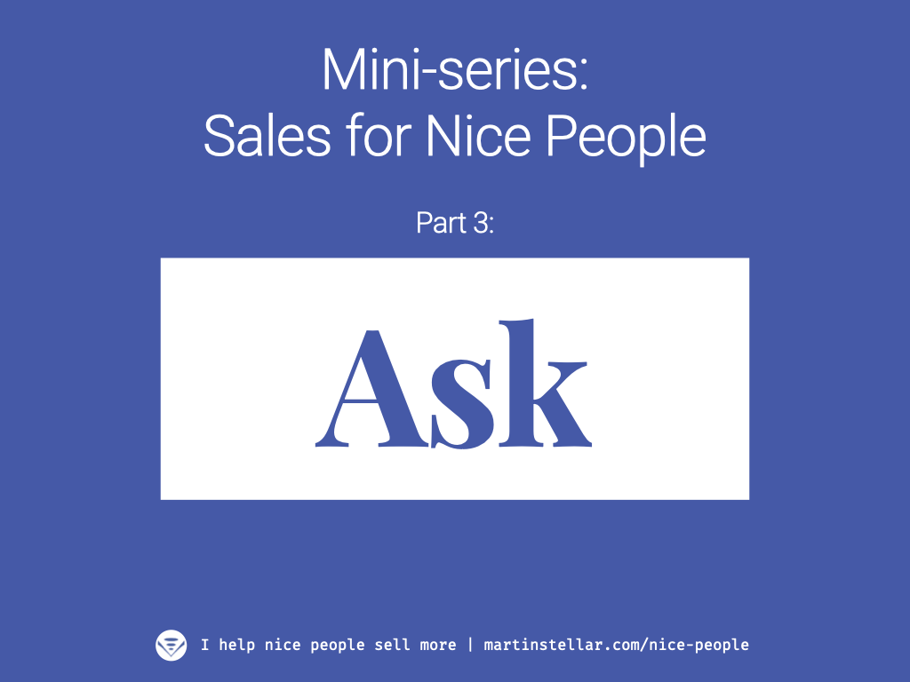

<iframe width="560" height="315" src="https://www.youtube.com/embed/n4SkaGX_L_M?si=sCztbh6aYMlOFn-T" title="YouTube video player" frameborder="0" allow="accelerometer; autoplay; clipboard-write; encrypted-media; gyroscope; picture-in-picture; web-share" referrerpolicy="strict-origin-when-cross-origin" allowfullscreen></iframe>

 
<iframe width="100%" height="180" frameborder="no" scrolling="no" seamless="" src="https://share.transistor.fm/e/5c54a252"></iframe>

---

Did you know:

- If you ask your buyer for the sale, you're doing them a favour because you'll be relieving the tension?
- If you ask your buyer to tell you no, they'll trust you more because you won't look needy?
- If you ask for the money, you're serving your buyer because you're making them think about the cost of keeping the problem, vs the cost of getting rid of it?
- If you ask a buyer what a proposal looks like to them, they'll give you intel on where they are in their buying process?
- If you ask for the sale too soon, before you've assessed that they're ready to do business, you might ruin everything... but asking about their vision first helps you avoid that?
- It's not your business whether they buy or not - it only become your business... and when you make that clear, your buyer enrolls themselves?
- That convincing and persuading are some of the worst things you can do?
- That people love to buy, they just loathe being sold to... so if you make it easy to buy, you won't have to do any convincing and persuading?
- That asking questions helps your buyer get clarity, which leads to vision, which is required for them to make a decision?

What all these items have in common, is that you're making the sales process something based on dialogue, conversation, exploration.

Which is wildly different from the tired old 'let me pitch at you until you succumb!' approach that so many people still use, and that many sales gurus still teach.

But we here, we're nice people. We don't want to be pushy or annoying. And we don't want to assume that we know what's best for people.

Which is why I created the SFNP framework: for good eggs to have an easier time selling their work, and at rates that your work is worth, too.

Because look, business is hard enough as it is. 

And you're not meant to struggle through the sales process.

In fact, if you're an ethical entrepreneur and your work truly makes a difference you're meant to enjoy helping people.

Which is exactly what you do when you apply the Sales for Nice People system.

It turns your entire sales process into an act of service, where you're helping your buyer to gain insight and clarity, and where you elegantly guide them to a decision.

And because your basing your sales process on understanding and helping, you're making it far more likely for that decision to be a "Yes, let's do it, how do we start?"

And, bonus: If your buyer isn't ready yet and you need to follow up, they're going to be much more likely to reply, because they experience every interaction with you as something pleasant and helpful.

Put differently: Sales for Nice People is the remedy for getting ghosted, and for feeling like selling is a necessary evil.

Which it isn't, not if you do it right.

What 'right' looks like, that's what you learn once you enroll in the 10-week 1 on 1 training programme.

Each week we spend 40 minutes on Zoom, where the first 20 minutes is for you to learn a chapter in the system, and the final 20 minutes you get me to coach you on the deals in your pipeline.

You don't just learn how to sell, you also get personal guidance and coaching on the actual deals that you're working on.

So let me ask you:

Is it time for you to finally get a grip on that selling thing?

Cheers,

Martin

P.s. If the answer is 'yes', here is where [you can enroll in the programme](https://martinstellar.com/sales-for-nice-people-info/). And if it isn't, feel free to hit reply and let me know what the obstacle is?
