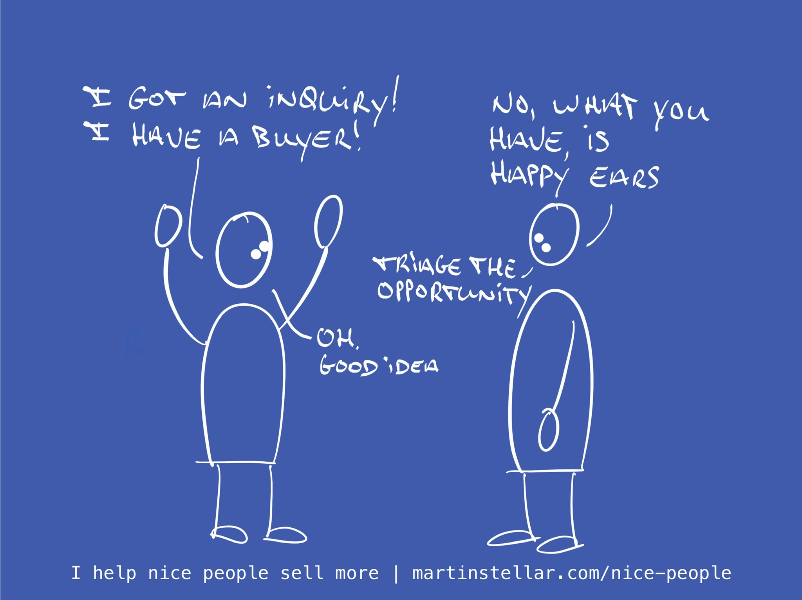

---
tags:
  - Articles
  - ClientFilter
  - Efficiency
  - Pipeline-Management
  - Trainings
  - Triage
pubDate: 2024-12-10
type: sfcContent
location: 
cdate: 2024-12-09 Mon
episode: 
imagePath: "Media/SalesFlowCoach.app_The-triage-call-because-you-shouldn't-waste-time-on-unqualified-buyers_MartinStellar.jpeg"
title: The triage call mini-training Pt 0
excerpt: "Life's too short to deal with opportunities that won't turn into sales. Triage and disqualify your buyers so that your pipeline work stays efficient."
---

> [[🏋️ Trainings]] >> [[📄 Mini-training - The Triage Call, Chapter 0]]

It's real easy to get nothing done and go nowhere with people, and churn away your time on sales opportunities that aren't going to happen: Just make sure you're talking to the wrong person.

No, you're not going to get a vegan to buy your leather shoes.

A technophobe won't be interested in your AI solution.

Someone with a McDonalds tattoo (do those exist? I wouldn't be surprised) probably won't be dining at your fancy restaurant.

Of course these are all blatantly obvious examples - but it's the less obvious ones that cause us to engage with buyers who just aren't the right fit.

And the sooner you can figure out whether someone is the right fit or not, the more efficient - and pleasant - your sales process becomes.

Enter: the Triage Call.

As in: the very first meeting, where you're not supposed to try and sell anyone on anything, not even on the next meeting.

Instead, the only purpose of a triage call is to figure out whether or not it makes sense, for both parties, to engage in a process of discovery, scoping, and selling.

And for that, I've created a mini-training that launches tomorrow, which will teach you the 7 fundamental questions you need to get an answer to, in your very first meeting.

Once you understand how to ask those questions and assess what type of buyer you're dealing with, you'll find that you have fewer wasted meetings with people, and also:

You'll find that by asking these types of questions, you actually prepare a buyer for engaging in the sales process with you.

So stay tuned for Chapter 1, in your inbox tomorrow.

Meanwhile, a question for you to ponder:

How often do you 'put on happy ears', and tell yourself that this person is a qualified buyer, when actually your gut tells you there's nothing there?

Next: [[📄 Triage call Pt. 1 - What's the problem?]]
