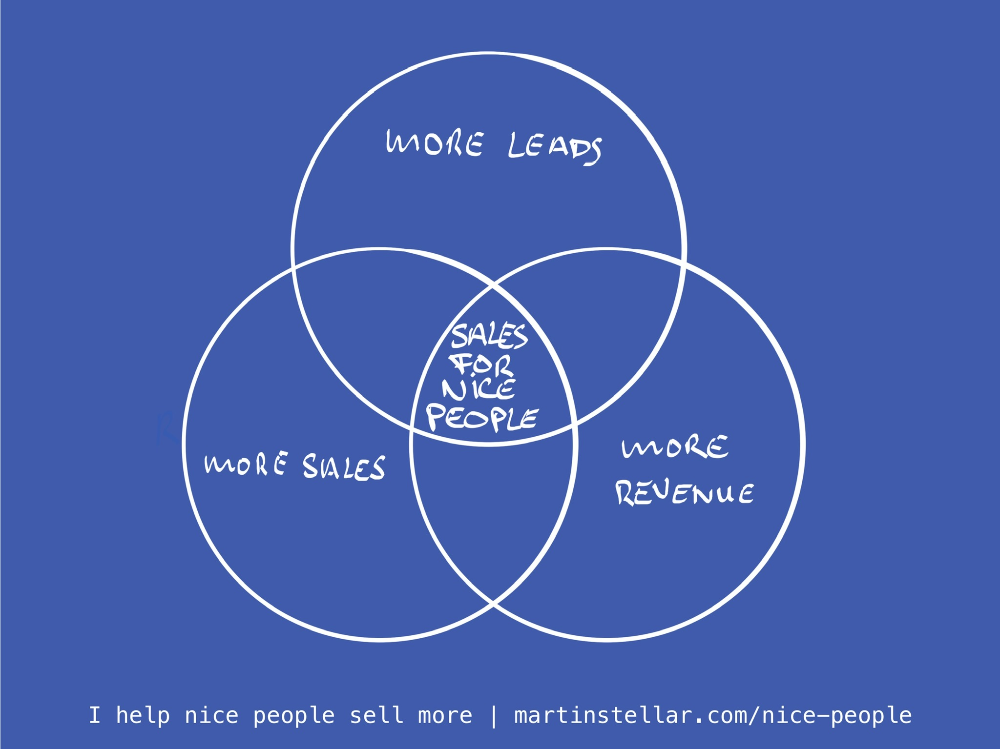

---
tags:
  - Articles
  - SalesForNicePeople
pubDate: 2024-09-16
type: sfcContent
location: 
cdate: 2024-09-13 Fri
episode: 
imagePath: Media/SalesFlowCoach.app_More-leads-more-sales-more-revenue_MartinStellar.jpeg
---

Had a chat with a former client recently, who told me she had been considering buying the Sales for Nice People training, except...

Would it make sense to get better at selling, if she didn't really have enough leads in her pipeline?

A fair question, to be sure.

After all, why would you spend money on improving something - i.e. selling - if you don't get enough opportunities to have sales conversations?

The answer is simple: Yes, it makes sense. Lotsa sense, in fact, and for a number of reasons.

When you let Sales for Nice People be your approach to selling, several different things improve in your business:

Your messaging gets tighter and more focused.

You learn which people to focus on, and which niches and leads to avoid.

You become more focused on working your deals and staying on top of your pipeline.

Reaching out to people becomes easier, and even fun.

You realise that you have far more opportunities available in your world, because you learn how to see selling and marketing as acts of service.

You discover that your brand, and your positioning, are much stronger than you thought, you end up improving it even more, and you learn how to get more and more specific in communicating to people why you are the best and most qualified solution for their challenges.

And you get a lot more leverage and results out of everything you do to generate buyers and revenue.

How can I be so certain?

Well, if you spend a few hours going through all the articles and workflows in SalesFlowCoach.app, you will probably see how a comprehensive and structured training programme based on my methodologies would improve the above, and more.

But also:

The 16-week training consists of weekly sessions where for 20 minutes I teach you the system, and the next 25 minutes you get personal, 1 on 1 coaching - and that can be on whatever you want.

As in: if you have deals and you want to close more of them, then that's what I help you with.

But if you don't and you want to start more relationships and conversations, then that's what we talk about.

Or if you want to improve your website copy and your sales pages, I dust off my copywriting-hat and we go to town tweaking and optimising your copy, right then and there in your session.

Or maybe you want to create a magnificent lead magnet, or generate referrals, or design a social media content strategy?

You got it, every week, for 16 weeks straight. It's your session, you decide what you get coached on.

So yeah, Sales for Nice People makes sense, even if - or maybe, especially if - you don't have that many leads.

Because it's not just a sales methodology, which you'll have noticed if you pay attention to these emails.

Hidden Sales Assets, The Empathy Edge, the L.I.V.E. model, the Mine Your Network for Opportunities system all the content in SalesFlow Coach...

All the approaches and systems I create:

It's all part of a larger, integrated whole of methodologies, it's an ecosystem - I dare say, a little world - of knowledge and behaviour and focus and systems, all designed to enhance and improve you entire way of *finding strangers and turning them into clients.*

Which is why if you can't or won't spend any money, you'd do really well to listen to the Sales for Nice People podcast, and follow me on social media, and **definitely** read everything in SalesFlowCoach.app.

But if **are** ready to invest in your overall ability to grow your business, and you want me to personally teach and coach you for the next 16 weeks, then [**this** is where you can get started. ](https://www.paypal.com/cgi-bin/webscr?cmd=_s-xclick&hosted_button_id=Y79LKQ4UQ2B5Y)

Heads up:

I've decided to raise the price of entry to $3000, by $100 per day starting Monday. If you want the 16-week training for the current price of $1490, this weekend is your last chance.