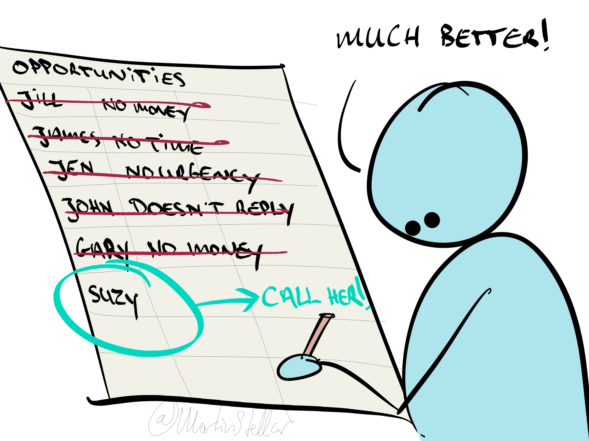

You know what I think? I think you should stop having all those conversations.

You know, the conversations with buyers, the sales calls, discovery calls, chemistry sessions, demos, emails, DMs, followups, what have you. Just stop it.

But wait, am I not the guy who's always saying that a sale happens in the context of a conversation?

Yes, I am.

So, should you not have more conversations, instead of fewer?

Well, maybe not.

Maybe you'd be better off having less of them.

Because look: the simple fact is that the majority of the people who are in your pipeline - who are in your list of potential buyers - are never going to buy.

Maybe they're not the right fit, or it's not the right time, or they don't have the funds, or their problem isn’t urgent enough.

It doesn't matter what the reason is: a lot of people - the majority - are just not going to be your client.

So for you to keep these people in your pipeline, and to go back to looking at them and checking them out on social media...

Seeing what's up with them, and following up, and trying to get another call booked in...

It's a complete waste of time for you, as well as for them.

Costly for you, and a nuisance for them.

So the best thing that you can do: become more discerning in terms of what actually makes somebody a qualified prospect - or, indeed, a disqualified prospect - and deal only with those people who are actually qualified.

So if you want your whole sales process, and your funnel, and your entire lead generation easier and more effective:

[[👨‍🎓 How to clean up deadwood|Remove the people from your list]] that in your heart of hearts, you know are just not the right fit. Takes a bit of courage, and requires that you don't fall prey to FOMO...

But life's too short to spend time on people who aren't right for you, so you might as well just focus on those who are.

---

That then leaves the question: those people that you do engage with... what do you tell them? When you have a meeting booked, or they reply, or you need to create a proposal or set a price for a project... what do you say, what do you ask, how do you move this deal forward and get your buyer to sign off and hand you money?

To answer that, all you need to do is pull up your phone, log into your Personal coaching thread in  SalesFlow Coach, and ask me a question. Within hours, you'll know exactly what to say or ask in your next buyer interaction.

It's basically a sales coach in your pocket, available 5 days a week, and you can get that access to me for $99 per month. [More information here.](https://personal.salesflowcoach.app/)