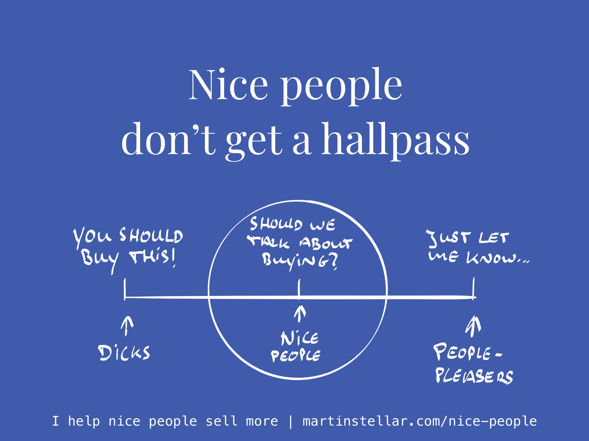

---
tags:
  - Articles
  - SalesForNicePeople
pubDate: 2024-07-24
type: sfcContent
location: 
cdate: 2024-07-23 Tue
episode: 
imagePath: Media/SalesFlowCoach.app_Nice-people-don't-get-a-hallpass_MartinStellar.jpeg
podStatus: Published
---

Yesterday on a podcast interview, the host told me how in his niche, people are often very conflicted about selling, often leaving the decision to book a new session or renew a programme to the client.

"Here's the link, just schedule whenever you want".

On the surface that might seem like a nice way to treat people, but actually, that's doing people a disservice.

See, you might be nice people, but that doesn't absolve you of the duty and responsibility to help your buyers.

Of course you don't want to be at the other end of the spectrum either, where a buyer gets bullied into buying.

But to be wishy-washy about it, and leave it entirely up to the buyer?

Without helping them make the decision that's in their own best interest?

That's wrong.

Because we all have a life to live, and we all have countless decisions to make, and your buyer has a million demands on their attention and time.

For you to then be soft about it, and leave your buyer to make their decision on their own, means it's very likely they won't make a decision at all.

And that means they won't get the outcome you sell, and that doesn't help them.

Or, even worse, they might get roped in by someone with a stronger sales approach, and then there's a real chance they spend money on the wrong provider.

All because you weren't able to properly help your buyer make a decision.

Put differently: not being able, or willing, to have a respectful, helpful sales conversation with your buyers, puts them at risk.

Which is why as a good person, you don't get a hallpass. Being a nice person does not absolve you of the responsibility to help your buyers decide.

It's your moral and ethical duty as a provider of high-quality services, to help your buyer make a decision, to either buy or not buy.

But you don't get to just leave it up to them, because then all you're doing is people-pleasing, and that helps nobody.

So here's the fork in the road for you:

To the left, there's the path of 'carry on as before', where you sometimes sell, but often you don't, and each time you don't, your buyer might get worse or won't get better...

Or, you take the path on the right, where you meet with me for 10 weeks straight, and each week I will teach you the psychology and mechanisms of ethical selling.

And, each week we will discuss the opportunities and deals that you have on the table - we will analyse where each deal is at, and I will provide you with the messaging and pricing that gets your deals moving forward, and gets your buyers to send you money.

That training is yours to have for a one-time $1490, and it gets you ongoing support 5 days a week as well - any question you have, send me a message.

And, until this Saturday, you'll get a bonus, a Hidden Sales Assets Breakthrough Session, which will get you enormous clarity on exactly which buyers to focus on, and what to say to them.

The result?

After 10 weeks you'll find your ability to communicate with, and enroll your buyers, massively upgraded, and you'll very likely have recovered your investment before the programme ends.

So if you truly care about your people, and they truly deserve your work, here's your choice:

More of the same... [or get Sales for Nice People](https://martinstellar.com/sales-for-nice-people-info/), and finally serve your buyers by helping them make the right decision...

What will it be...?

Cheers,

Martin
