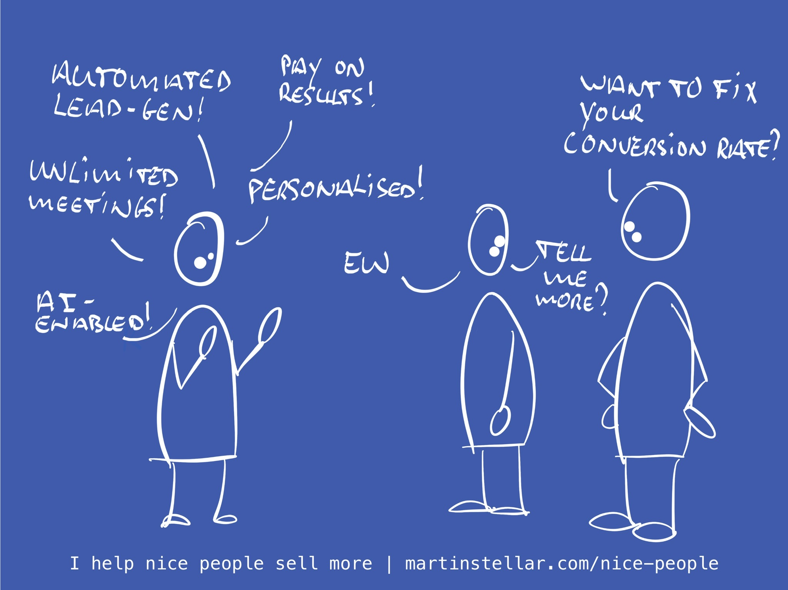

---
tags:
  - Articles
  - Empathy
  - SpammingPeople
  - TheEmpathyEdge
pubDate: 2024-09-09
type: sfcContent
location: 
cdate: 2024-09-09 Mon
episode: 
imagePath: Media/SalesFlowCoach.app_AI-Enabled-Lead-Gen_MartinStellar.jpeg
---

It's ironic, how sometimes you discover something that's been right in front of you for years, staring you in the face, and you just didn't see it.

In my case, today, that's discovering what is my nemesis.

And every business should have a nemesis, something you stand against, because that makes it easier for the right people to identify with you, and to self-select.

And what is that nemesis of mine?

It's the practice of blindly sending people perfunctory messages, 'personalised' based on some data that an AI tool scraped off of LinkedIn, or a company website or business directory.

A practice that has been around for decades, but which now has become even more prevalent because AI enables everyone with a credit card to blast out spam in volume.

And it's getting out of hand, too:

A few weeks ago someone sent me a DM, proudly stating they sent 7500 messages a day, and generated 33 meetings in a week!

Wow, really. You send 22,500 messages, only to get 33 meetings? So impressive.

But wait, there's more!

Because last week I saw someone in a group asking what email platform to use, if they want to send more than 1 million emails.

Very impressive, to send a million messages. But: will somebody please think of the dinosaur bones that get burned, doing that?

Seriously though: what on earth makes it right to spam a million people at a time?

But aside from my grumpy-old-man rant, there's a real, costly, and potentially devastating reason to avoid all that automated lead-generation.

Consider:

Some dude sends me a 'personalised' message, saying they can get me meetings with 'qualified buyers', and I only have to pay on results.

Right. But this sender's targeting is completely broken, because if they'd have seen the content I post on social media, they'd have seen that I frequently rant against badly targeted spam.

So if I were to hire that lead-gen agency, I'd end up with meetings in my calendar that are as badly targeted as what the dude sent me, and I sure don't want to waste my valuable and scarce time in meetings with the wrong type of lead.

So no, Mr. Dude ain't getting my business, nor any of his competitors, and I sure don't recommend you give them your business either.

What I do recommend, is that you fix the leaky bucket.

As in: convert more of the right-fit leads that you have, into actual clients.

Because we all have leads, and we all lose deals that ought to have closed.

And the reason they don't, in many cases, is that we miss crucial points in what your buyer wants, and needs, and is concerned about.

Put differently: we often lose deals because we don't **get** our buyer. And it's real hard to get a sale, if you don't get your buyer.

And to help you get your buyer, and the sale, I'm running a workshop this Thursday, where you learn The Empathy Edge.

It's a method for questioning and analysing your buyer's situation, their concerns and wants and aspirations.

The workshop is only $97, and comes with Q&A and three 30-minute followup sessions, and is designed to fix three problems:

- Long sales cycles
-  Buyers who should have bought but who disappear
- Pushback on pricing

It will enable you to avoid "I'll let you know" responses, and instead causes buyers to say "How does it work?", "Where do I pay?" and "When can we get started?"

The Empathy Edge helps buyers enroll themselves, and it'll make a massive difference to your sales process.

Instead of stuffing more leads into the top of your funnel and seeing them drop out, you get to convert more of the leads you generate, into clients.

I don't know what your sales process looks like, but if you're like most business owners out there, you have leads that should have bought but didn't. The Empathy Edge is what makes the difference.

Registration closes tonight at 7PM CEST, and there's only a few seats left.

Hit reply if you'd like to join us, and I'll send you a checkout link.

Cheers,

Martin
