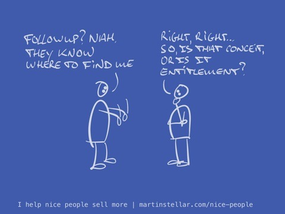

There’s a popular idea, that if we’re good people and we’re in business with a purpose, we don’t need to do any selling, or indeed: followup.

Apparently, our heart is so much in the right place, and our product or service is so good, and solves such an important problem, that people will seek us out and sell themselves on buying from us.

“They know I’m here. They’ll let me know when they’re ready” is how the thinking goes.

But that’s entitlement. If you're lucky. If not, it's plain conceit.

It doesn't matter how good of a person you are, or how good your work is:

People aren't going to just show up and throw money at you.

Which, if you are a good egg, is something you’ve probably noticed:

For some weird reason, if you don't get yourself out there and engage people in conversations, they don't buy your work. (Also see: [[📄 Stop giving money to your competitors!]]).

But if you want people to benefit from your work, and you want your company to thrive, you have no choice but to engage in marketing and sales, and follow up with peole, as well.

And if that makes you want to close your laptop and pretend you never read the above, remember:

All that's required for you to sell your work, is generating, and having, the kinds of [[📄 Agendas and framing - How to start a sales conversation|conversations ]]that help your buyer gain the clarity they need, in order to make a decision, be that yes or no.

That way, selling itself becomes an [[📄 The Shift in serving customers even before they buy|act of service.]]

From "Hey I'm awesome and now everybody should come to me, and buy already", to:

"Hey, can I help you figure out your best next step?" Simple, pleasant, helpful - and gets you sales, too.

You're not entitled to any clients.

But you do have an option (and I dare say: a responsibility) to help people figure out what their best choice would be, simply by getting conversations started, and keeping them going. And last time I checked, having conversations is a [[📄 Can selling be fun?|fun human activity]].

And ain't it kinda magical how it turns people into buyers, if you simply have enough conversations, and with the right people?

