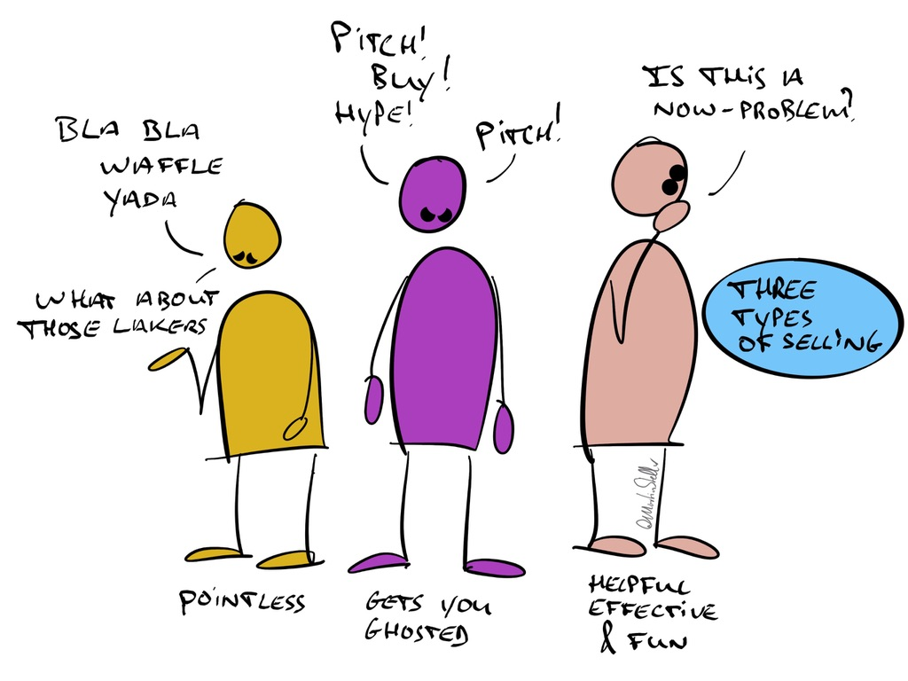

---
tags:
  - Articles
  - Questions
  - Communication
  - ProblemFinding
cdate: 2023-07-08 Sat
pubDate: 2024-03-15
type: sfcContent
imagePath: Media/SalesFlowCoach_Pitch-waffle-ask-three-types-of-sales-conversation_MartinStellar.jpeg
---

When dealing with a buyer, there's effectively three different modes of communicating.

The first one is when you waffle. Your narrative is unstructured, you jump from one topic to the next, you chat about the weather, you're not driving towards an outcome or goal, you don't [[📄 Sell Stewardship]], and you generally waste your time as well as that of your buyer.

This often comes from a sense of insecurity, or neediness, or both.

The second is where you pitch. Features! Benefits! Our award-winning consulting service and our zero-risk guarantee policy!

It might work sometimes, but it's rarely fun - and if your prospect doesn't buy then and there, there's a good chance you'll get ghosted when you follow up.

Because if you act like a pushy salesperson, you get treated like one: you get ignored.

Then there's the modality of exploring, questioning, problem-finding, and helping your buyer get to clarity and a decision.

That modality is fun, useful, and received with gratitude.

Oh, and it's the type of conversation that makes buyers enroll themselves, which means you don't have to pitch and you don't have to feel awkward, insecure, or needy.

As I've said before: Questions are the answer.

Don't try to talk your way to the sale - instead, all you need to do is ask your way to the sale.

---

For those entrepreneurs who are wise to the power of asking questions, but you'd like to learn how to ask exactly those questions that make your deals move forward and that cause buyers to enroll themselves, consider [Sales for Nice People.](https://martinstellar.com/leap-ethical-selling-framework/)