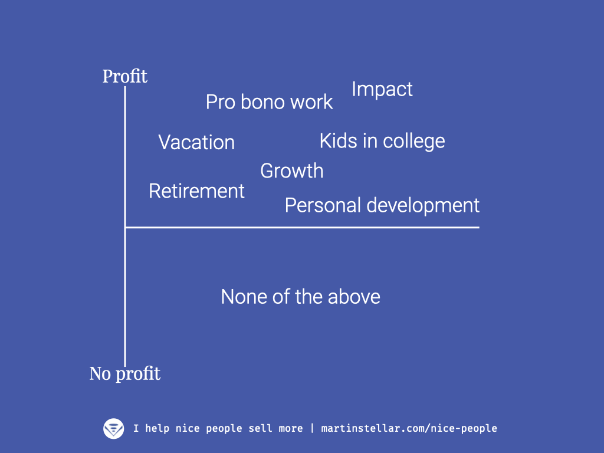

"Oh I don't want to charge more than I need, you know. I don't want to be greedy".

I hear that far too often.

What I'll never tire of hearing though, is when a student goes "Martin, you were right. I doubled my rates, and now it's easier to sell my work and I get happier clients too!"

See there's a pernicious misconception among high-integrity entrepreneurs, that there's something wrong with making a profit.

And yes, if you're a corporation and you seek to please your shareholders by way of price-gouging or exploiting your customers, then there's definitely a lot wrong with that.

But if you're a regular business owner, trying to make things better by making better things, as Seth Godin likes to say, then it's your duty to make a profit.

Because profit enables you to sustain your business. And that's not all.

For instance, profit enables you to:

- Take more time on projects, if that's what's required
- Invest in education, in order to deliver constantly improving quality
- Invest in growth, so that you get to share your better thing with more people, and make things better on a larger scale
- Put your feet up on the desk now and again, to sit back and properly think
- Do pro bono work, and help people who can't afford you

Whereas if you charge modest rates, you end up with stress, which downgrades your performance and shortens your lifespan and that of your business as well...

And then how do you continue to make things better for people?

You can't, is the answer.

No, if you're a business owner who truly cares about what you put out into the world and what that does for people, then you owe it to your people to be profitable.

Not to mention the vacation you owe yourself. Yeah I know. Ouch.

Now here's the funny thing:

Everyone who has taken the SFNP training, and who has had the gall to increase their prices, has been able to earn far more, and make much more profit.

Because one of the things Sales for Nice People teaches you, is how to set prices that actually enable profit, AND: how to communicate with your buyers in such a way that you not only earn more and make a bigger profit:

You'll also find your buyers are more likely, and more willing to pay higher prices, because of the way you handle the sales process. And that's what you learn in the 10-week personal training programme.

I'm telling you, it's transformative, life-changing, business-changing, profit-changing. And all in a very good way.

More information here, and direct access there.

See you on the inside...
