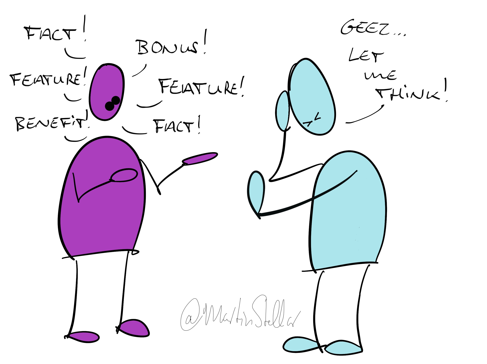

We usually say too much.

We don't let the other person think.

We say a thing, and before the other even has time to process it, we add something else.

All in an effort to make our case, to try and find the one thing we should say, so that we pull the other person over the line.

But the more you say, the more homework you give your buyer.

All the notions, facts, interesting tidbits and relevant ideas that you add in, they don't help.

In fact, loading up your communications with notions and messaging doesn't increase the chance you'll land the sale... Instead, it's more likely that you end up ruining the sale.

Why?

Because overwhelm causes confusion, and a confused mind doesn't make a decision.

And when the decision to make is 'buy/don't buy', you want your buyer to have clarity, not confusion.

You want your buyer to process and compute and integrate, all the aspects and elements of the decision - and they don't get the time or space for that when you keep talking at them. 

So, keep things short and simple. Stay on point.

Your words should create space for buyers to reflect, not fill their head with whatever you think is important.

And to keep things really short and simple: Get on board for the [Sales for Nice People training](https://martinstellar.com/leap-ethical-selling-framework/), because you'll end up selling more with less frustration and struggle. Just saying.