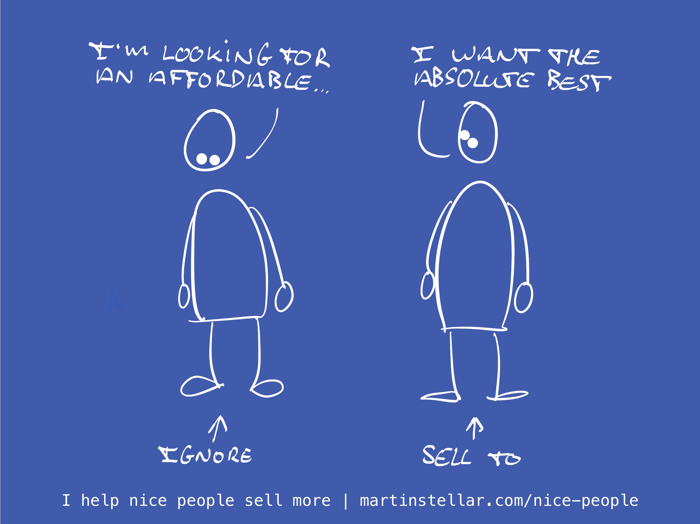

---
tags:
  - Articles
  - Pricing
  - Avatar
pubDate: 2024-11-21
type: sfcContent
location: 
cdate: 2024-11-21 Thu
episode: 
imagePath: Media/SalesFlowCoach.app_Sell-to-people-who-want-the-best_MartinStellar.com.jpeg
---

It's not enough to look for buyers who have a need, a budget and urgency.

In fact, if you want your sales to get easier and if you want to generate more revenue and profit, you might want to consider selling to people like me.

Why?

Because when I go out to buy something, I look for quality. And, I'm willing to pay high prices for quality stuff.

This applies to utilitarian purchases like shoes or a computer, but it applies especially to services like coaching or consulting: I want quality and I won't settle for anything mediocre.

I want excellent work, done by a consummate professional, who has all the time required to deliver a truly terrific quality service.

So yeah, I'll happily pay $1000 for an hour of coaching, from that one coach I know, and who is superbly skilled. (Well... I used to. Last few calls we had, the QoS wasn't as before, and so I didn't return for more.)

Anyway: I like to buy quality and I'm willing to pay for it, and when I see someone with market-compatible rates, someone affordable?

I ignore them, and keep looking.

Not only because high prices signal quality and give me an expectation of quality:

It's also, and very much so, because when someone runs affordable pricing, they're very likely to struggle to make ends meet. Someone who prices themselves at the edge of what the market is willing to pay, or below that, is in competition with similar people. Has to work hard to stand out and land the next buyer.

Which is true for expensive coaches and consultants as well of course, but here's the difference:

When an affordable consultant lands a new client, *they sell time* in the calendar, and limited time has to be divided between an increasing number of clients.

And that means there's going to be less time and attention for me the more they sell - and there will also be less time and attention for me if they don't sell, because then they'll have to scramble for new clients just to pay the bills.

But an expensive consultant?

When they land a new contract, they don't sell time - *they buy time.*

They get paid so well, that they can shovel untold amounts of time into serving that buyer to the very best of their abilities. They buy the time needed for delivering exceptional results. They can take a bit of pressure off business development, and put that pressure on giving me greatness.

So yeah, I'll happily pay high prices. (Also: don't @ me with your pitch. Or maybe do, but then the deal is that I'll give public feedback).

So in a sense, I'm a discerning buyer, and the good news is: I'm not the only one in the world.

For your work there are also buyers who don't give a damn about affordable deals: they want the best, and they're willing to pay for it.

So if you deliver high quality services, should you not sell to people like me?

Cheers,

Martin

P.s. If the answer is yes and you want to learn how to find, engage with, and convert people like me, [Sales for Nice People teaches you exactly that](https://martinstellar.com/sales-for-nice-people-info/).