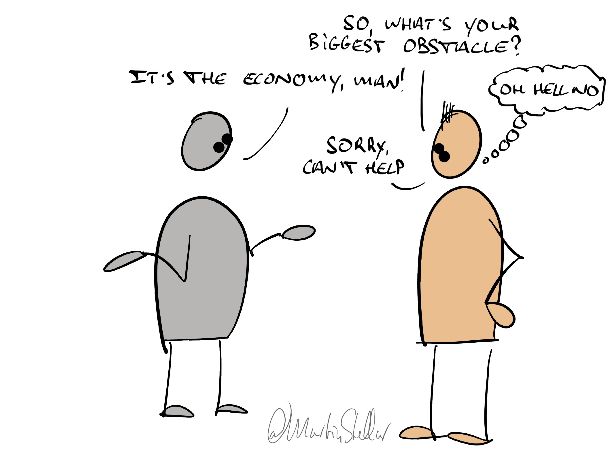

Maybe you've never thought of listing red flags and defining your anti-avatar, but you might want to give it some thought.

Because some people are just a dream to work with. They show up on time, they ask ‘ok but how’ instead of saying ‘yes but’, they take ownership of change, they do their homework, and they make it exceedingly fun to be in business. It's the kind of client that makes you happy to be your own boss.

Others though, are a struggle to deal with. They cost way too much energy, they argue for their limitations, they don't respect your time, and they make the process of serving them hard on you.

This is why every business owner needs to know who is [[👨‍🎓 SIBG Pt. 1.1 - How to define your customer avatar|their ideal customer, or avatar]].

But knowing who is ideal isn't enough:

You also need to know exactly who are the people that you do *not* want to work with - kinda like an anti-avatar.

Otherwise, you’ll end up thinking that you're talking to an ideal ideal client, and you’ll miss the signals that this or that potential client is going to be a major pain in the sitting apparatus.

And once those folk come through the door, dealing with them and serving them is going to be a hassle and a struggle.

So:

Make a ‘hell no’ list, of all the things that a client should NOT have, or be, if they are to qualify for buying from you.

For example, in my business, I can’t work and won’t work with anyone who doesn’t take full ownership of change. My clients need to own their problems, instead of blaming people or factors outside their control. If they don't, then it’s a hard no from me, because you can't help someone create change unless they make themselves the one responsible for creating that change. 

So one of the questions I ask when meeting a buyer, is: “What’s the biggest obstacle that stands in your way?”

If they then reply by blaming things like their team, the economy, or legislation, then I'm probably talking to someone I shouldn't work with.

After all, "My team isn't performing" is very different from "I need to get better at getting performance from my people." Right?

Simply put, 'blaming externalities' is one of the items on my no-list, along with hagglers, people who show up late, or who complain, or who lie... and there's a bunch more.

And each time I see one of those items in a buyer, I know that we're done here, we're not going to work together, and we can both go about our business.

It takes a bit of courage, especially when you don't want to miss out on opportunities, but the result of keeping a no-list has enormous benefits.

You'll have fewer opportunities and meetings, but you'll not have to deal with anyone who is a bother or a frustration. And let's face it: life is too short to be around bothersome people or to take on frustrating projects.

So make your ‘hell no’ list, and identify the different ways in which people could signal to you that they are people you ought not work with.

Next?

Better clients, more fun, less hassle... and an easier time having sales conversations that lead to a sale. 

