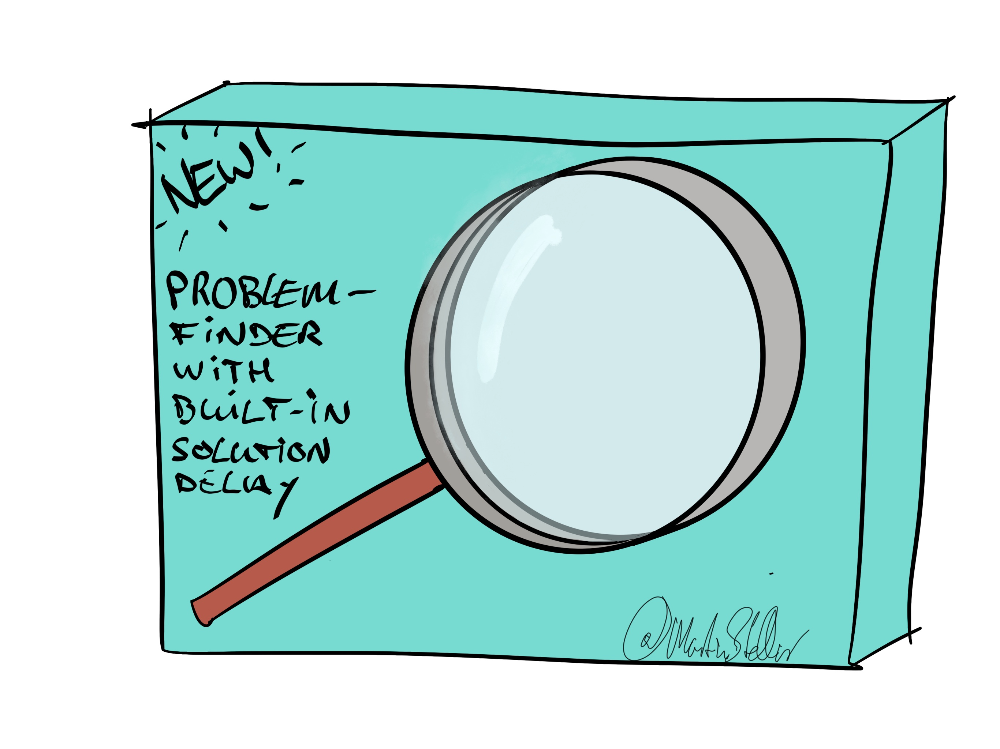

Want to know how you can make your selling and enrolling a lot easier?

Stop solving problems.

“But Martin, you fool! Solving problems for my clients is the whole reason I'm in business. It's what I do, it's what I get paid for!"

Ok, that's good - I like you already.

Very often though - and I see this all the time - people are much too quick to come up with a solution.

They hear about a problem, and go straight into problem-solving mode.

But before you get to that point of solving problems, it is really important that you dedicate yourself to the process of *problem-finding*, first.

That’s the mode you should be in, when you start engaging with a buyer.

You ask, your probe, you query… you do all you can to [[📄 What's their problem-stack?|get to the heart of the matter]].

That way, you learn the ins and outs of what a buyer is actually trying to accomplish with you, and - very importantly - you shine such a big spotlight of clarity on the problem and all its implications, that the buyer themselves will ask:

“Hey, how would you solve this for us?”

That’s the point where you get to talk about your solution. Not before.

Otherwise, your buyer will feel bypassed, you’ll appear tone-deaf or self-involved (“Look at my great solution!”) and there won’t be any sale.

As I’ve said before:

Ask about their problems, right up until the moment that they ask you about [[📄 Sell a remedy, not a pain-killer|your solution]].
