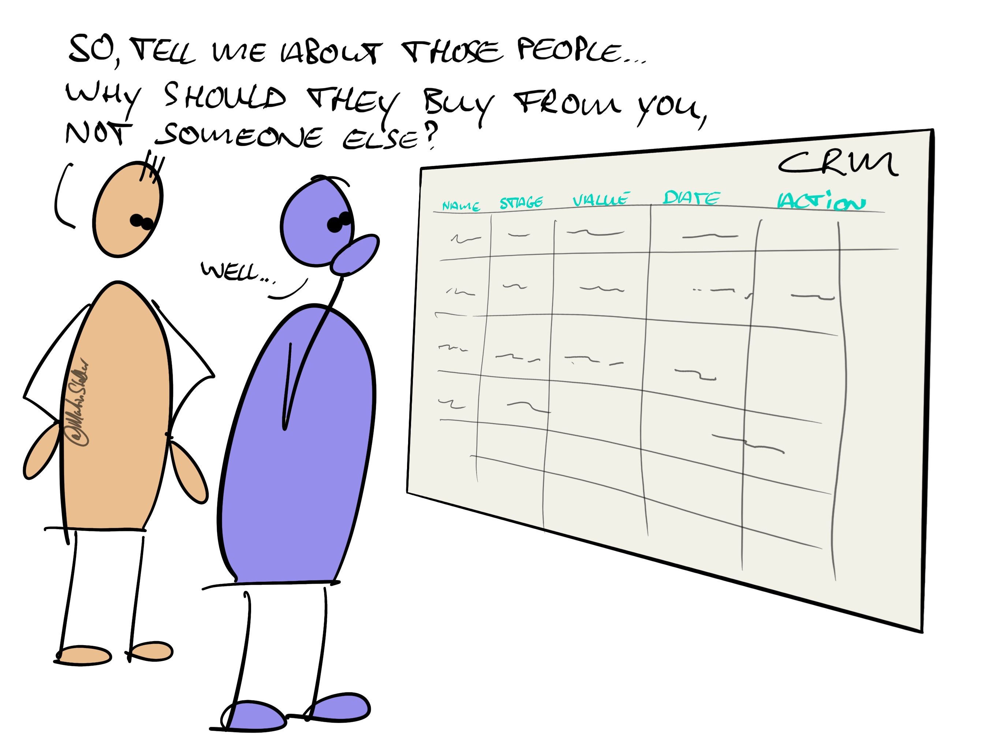

---
tags:
  - Articles
pubDate: 2024-04-18
imagePath: Media/SalesFlowCoach.app_the-secret-to-getting-more-sales-in-only-60-minutes_MartinStellar.jpeg
title: 📄 The "secret" to getting more sales, in only 60 minutes
type: sfcContent
docStatus: Slated
episode: "33"
---

The better you understand something, the greater your ability to work with it, improve it, and make things happen.

Nowhere is this more true than when we're dealing with people, and especially where it comes to marketing and selling:

If you don't understand, on a deep psychological level, who your buyer is, all you have available to you is slinging perfunctory messaging at them:

"Hey, just circling back, did you read that proposal?"

The result?

A pipeline full of stagnant deals and people who ignore you... when in many cases, those people really need your help, and the sooner the better.

The solution?

A thoughtful approach, where instead of nagging people on, you take your time to properly think about this person and company, and you ask yourself questions about them, and about what would be the best message to put in front of them, in order for them to bring themselves closer to buying from you.

Here's where most people get stuck: asking the wrong questions.

Because in most cases, for most business owners and certainly those not applying the Sales for Nice People methodology, the one burning question we want answered, is the one that ruins your sale:

"How do I get them to buy?"

If that's what you're trying to answer when looking at a buyer, you won't go very far.

If however you ask questions like "Why, indeed, should they buy?" or "What could be in the way of the decision?" or "Are they sufficiently aware of the cost of keeping the problem?", then your entire POV shifts, and your communication transforms.

Your messaging will go from 'vendor trying to sell something' into 'ally trying to serve a buyer into making the best decision'. And you bet that works.

And you know what also works?

Getting yours truly to ask the questions for you. Because I've spent 30+ years studying psychology, with half of that focused on buyer-psychology, marketing, sales, messaging, and all the things that make it easier for people to buy from you.

And today you can get me asking those questions at a very reasonable $295, which gets you a 60-minute Sales Breakthrough Session. We'll use the 4 pillars of sales and growth as our guideline, and I'll bring a whole bunch of pointy questions to help you identify opportunities, create insight, give you better understanding of your people and your deals, and also:

I'll provide custom messaging you can use when sending emails, or talking to people, or posting on social media.

And you'll be amazed what we can achieve in 60 minutes, when you sit down to think, with someone who truly gets sales psychology, and asks you the right questions.

Do yourself a favour: get you a [Breakthrough Session](https://martinstellar.com/salesbreakthroughsession/).

Your buyers will thank you, and so will your bank account.

Cheers,

Martin
