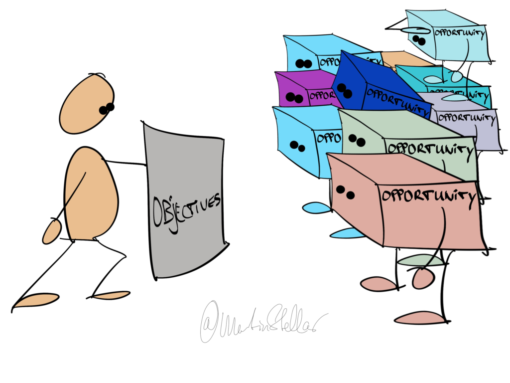

In a world as big as ours, there’s an unlimited amount of opportunities.

Every email you open, every streetcorner you turn, each stranger you look in the eye in passing, every book someone recommends:

You never know what opportunities you’ll encounter when you make a decision.

You’ll always meet opportunities.

But it can be hard to figure out which opportunities are worth diving into.

If you take them all on, you’ll end up adrift and directionless.

Following too many opportunities is a major cause of procrastination and stuckness (i.e. death by opportunity).

And there’s so many of them, all so interesting or filled with potential!

[[🤔 Simple questions to score and rank your opportunities|Should you take on that client]]?

Have that conversation you’ve been wanting to have?

Invest in that coach or that car or that SEO service?

Accept the invitation to speak at an event?

Dig through your journals from last year?

Read that book that your gut tells you will cause a big shift for you somehow?

Reply to that email you haven’t had the nerves yet to reply to?

Go on that retreat?

With so many choices and each with their own opportunities, how do we decide which of them ought to be in our lives or not?

If ever you’ve felt overwhelmed, or if ever you’ve gotten off course by choosing certain opportunities, the answer is:

Choose those opportunities that are aligned with your objectives, and that - if you analyse the potential returns logically, instead of solely following your instinct - stand a chance to directly contribute to your reaching your objectives.

That's the antidote to overwhelm, 'death by opportunity', and unfulfilling results.

Obvious and simple as a concept, but very tricky to put into practice. Works though.

Whatever goes in your mix of objectives (hobbies, revenue, relationships, fun or sales or fame or happiness etc etc), let that mix of objectives be your north star for decisions and the opportunities that you choose to act on.

Everything that’s not aligned: best ask yourself long and hard whether you want to go for it, be as rational about it as you can, and [[📄 Why you should eliminate opportunities|get rid of opportunities that aren't ideal]].

Because everything that’s not aligned with your objectives, and doesn't directly contribute to reaching them, will very likely prevent you from reaching them, or at the very least, distract you and slow you down.
