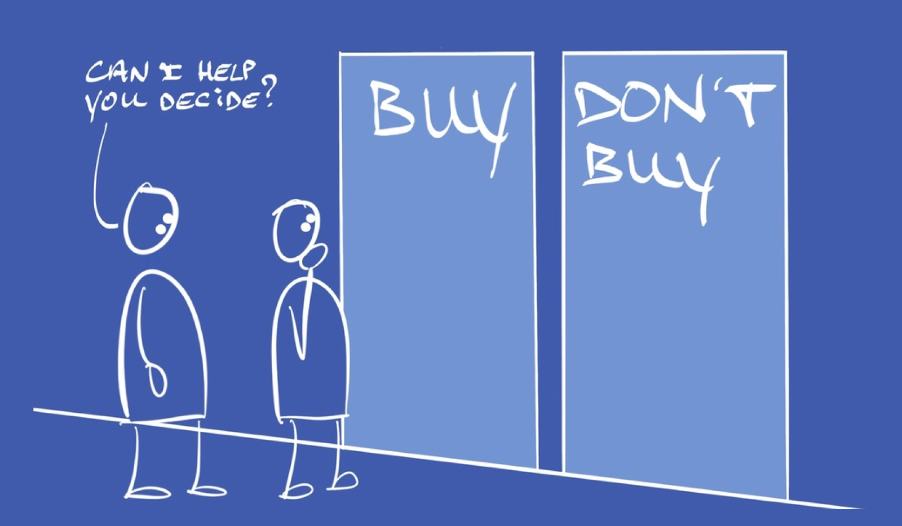

It's quite amazing how many folks have hang-ups, where it comes to selling their work: "Stressful", "No good at it", "Awkward", "I just want to do my work without having to sell"... These are some of the things people tell me.

It's a sad state of affairs, especially since most people have a truly valuable offer, are good people, and genuinely want to serve their buyers.

But, until you land a client, you don't get to serve that client, right?

Actually: wrong.

If you *really* want to serve a buyer, then your serving them starts before they buy.

If you truly deliver a rocking product or service, then your first order of business is serving your buyer, in the process of making a decision.

That decision being: whether or not to buy that product or service of yours.

It's a bit like coaching, in that sense: you're not there to convince or persuade, but to hold a space where someone reaches their own clarity, uncovers their own motives for making a decision (in this case: whether or not to buy), and where they enroll themselves into saying yes and sending you money. Just like a coach, facilitating a client's ability to make a decision.

This shift in attitude - from "I got something and I need to figure out how to get people to pay me" into "Let's help this person figure out if they actually want my thing" makes all the difference.

It changes the dynamics, creates conversations that are 0% pushy and 100% enjoyable, and lands you buyers that really want your work (eg. you drastically reduce buyer's remorse or landing the wrong kinds of buyers).

And, if a prospect doesn't buy, they'll remember you as someone with integrity, that they enjoyed dealing with, and they'll very likely welcome it when you follow up again in the future.

It's a significant shift, with big consequences, and all it takes is for you to reframe what a sales conversation is about.

From selling to serving, before the sale even happens - so that you get to serve your buyer even more, once they do buy. How nice is that?  
  
If you face any of the challenges mentioned here, Sales for Nice People is a system and a philosophy that turns the sales process itself into an act of service.  
  
Instead of feeling awkward or conflicted about selling, you'll learn how to handle the sales process in a helpful way that gives your buyer clarity, and makes it easy for them to make a decision.  

I've spent 30+ years studying psychology, business and human nature, I've been in business for 15 years, and I can show you how to have sales conversations that work, that buyers like, and that you don't have to feel awkward about.  
  
And not just because of the psych & biz of it all: Since I'm a former monk, values and integrity permeate every aspect of Sales for Nice People.

And as a former tailor, I can show you how to really read people, which is tremendously helpful, because once you learn how to really get your buyer, it becomes a lot easier to also get the sale.

Where 'getting your buyer' means: seeing the bigger picture, including their worries, their aspirations, and 'who they want to become next' (eg. the Identity-piece).

You know, so that you'll sell people a new version of themselves as per Steve Jobs, and not just a consulting project or coaching programme.

In short:  
  
Sales for Nice People presents a framework and approach for selling based on empathy, ethics and integrity, enabling you to sell more of your solutions, faster, at better prices...  
  
And you'll never have to go against your values.

Yesterday I released the book on Sales for Nice People, and for any ethical entrepreneur keen to sell more, serve more and earn more, [I highly recommend you read it.](https://books2read.com/salesfornicepeople)

