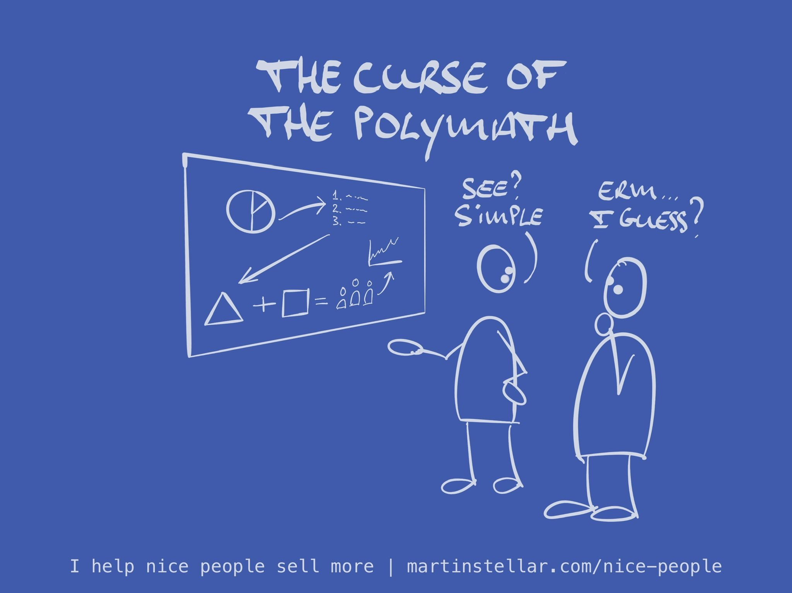

---
tags:
  - Articles
  - T-shapedProfessional
  - StalledDeals
title: " 📄 The curse of the polymath: why being multi-talented can easily ruin your sales"
pubDate: 2024-05-20
type: sfcContent
imagePath: Media/SalesFlowCoach.app_Why-a-polymath-or-t-shaped-professional-struggles-to-sell_MartinStellar.jpeg
---

Of course: being multi-talented - being a polymath - is a fantastic way to live and to run a business:

When you have a wide range of skills, intellectual curiosity and a drive to learn, you end up with the ability to handle and solve [[📄 Hidden Sales Assets 3 - Your ideal buyer's Problem-stack|very complex problems]] - the kind that to your buyer look so intractable, they wouldn't even know where to start.

And if you then also have one or two deep specialisations and you're able to really go to town solving problems, you would think that this makes for a very successful career as a coach or consultant.

But if you're that kind of person - a T-shaped professional - you've probably noticed that it isn't all that easy to land buyers.

Here you are, correctly diagnosing your buyer's very complex set of problems and challenges - and to you, with your varied skillset and deep specialisation, the problem is eminently solvable.

After all, you're that T-shaped professional, and you've spent decades developing your skills.

But somehow, for some reason, the buyers who most need your help often don't end up buying.

Even though their problem is urgent and painful and they have a budget, getting them over the line is a struggle.

When that happens, your intelligent ability to wrap your mind around that complex set of problems might be exactly the reason that the sale doesn't close.

So when you're in a situation where your view on a complex set of problems is "Very solvable!" but your sale isn't advancing: Slow down. Simplify, break things down into graspable chunks.

Very likely, your deal is stuck because while your buyer trusts *you*, they don't yet trust that the problem can get solved by you, and you can only get them to develop the trust that you can, by asking questions that help them wrap their head around the problem as well. 

