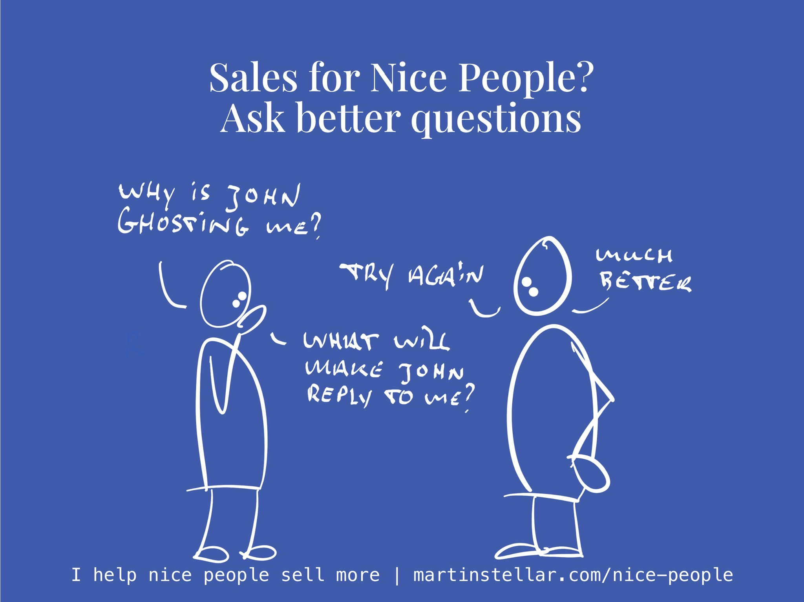

---
tags:
  - Articles
pubDate: 2024-11-04
type: sfcContent
location: 
cdate: 2024-11-04 Mon
episode: 
imagePath: Media/SalesFlowCoach.app_Ask-better-questions-to-get-more-sales_MartinStellar.jpeg
---

It's nice to have your USP figured out, and it's nice to answer "I help nice people sell more", when I'm at an event and people ask me what it is that I do.

But the other day while talking to a friend, I realised:

I don't actually do a good job of explaining how that works.

How, exactly, do I help people sell more, specifically nice people?

It's very simple: I ask questions.

For instance:

[[🚀 What needs to happen?|What needs to happen]] for this deal to mover forward?

What does your buyer stand to gain, on a personal level, when they buy your solution?

What's the cost of keeping the problem?

What's the [[📄 What's their problem-stack?|problem-stack]], the three-legged stool of interrelated problems, that your buyer faces?

[[📄 Are you selling them a problem? Mini series Pt 1 - congruently desirable offers|What problem does your buyer perceive]], along with the solution that you're offering?

What does your buyer need you to say, or ask, in order to go ahead with the purchase?

What buy-blocker stands in the way?

What would be unlocked, when your buyer buys?

Who has your buyer's ear, and how can you help your buyer communicate with that stakeholder, so that the latter becomes an advocate of buying your work?

As you can see, none of these questions are about the mechanics of the sale.

Instead, they are about the psychology of the buyer, and the relationship and communication that you have with them?

And that's why sales coaching is so effective, especially for good eggs and nice people:

Instead of dry, technical and mechanical things like objection-handling or how to pitch or how to write a proposal, the point is to truly get your buyer.

Because once you're better able to explain a buyer's problems and concerns than they have, they automatically credit you with having the solution.

This is why Sales for Nice People as a philosophy and system is so powerful:

It takes you from struggling to move things forward with your buyers, pushing boulders up a hill, to effortlessly engaging with them in a way that they enjoy, benefit from, thank you for, and that also causes them to want to buy your work.

So if you have the buyers, and too often the sale doesn't happen or you keep getting pushback on pricing, maybe sales coaching will help.

If so, there's three ways I can help:

1. Text-only coaching. With a subscription at just $99 per month, you get to send me messages any time you want, and I'll reply within 24 hours, 5 days a week.
2. Spot-coaching. This model enables you to book 15-minute calls right into my calendar any time you need direct input or feedback (and you get to send messages as well). At $1000 per month, it's the perfect solution for business owners who juggle several complex deals at once.
3. Unlimited coaching. This model gets you a weekly fixed call, plus any extra calls, meetings or help you need, including weekends. And you get to put me on speed-dial as well, so whatever issue or challenge shows up in your business, you just call me. That's $8300 per month with a 3-month minimum commitment so it only makes sense if your business turns over 2 to 3 million a year at a minimum, but if that's the kind of level you're at and you want to level up, it might be just right for you.
Of course if we never met or you've never had any coaching you might not know if this kind of coaching will work for you.
But if you're curious and you want to find out if it will, you can get yourself a [Sales Breakthrough Session for a one-off payment of $295, right here](https://martinstellar.com/salesbreakthroughsession/).
Either way:
Your buyers need your help, and it's your job to enable them to make a decision, to make it easy to buy.
And you'll find that once we start asking pointy questions about your deals and your buyers, it becomes a lot easier to land your sales - and also, to get paid what your work is actually worth, which is probably a lot more than you charge at the moment.
Anyway, if you want more sales and end the year on a high note, [a Sales Breakthrough Session is going to be a massive unlock.](https://martinstellar.com/salesbreakthroughsession/)
