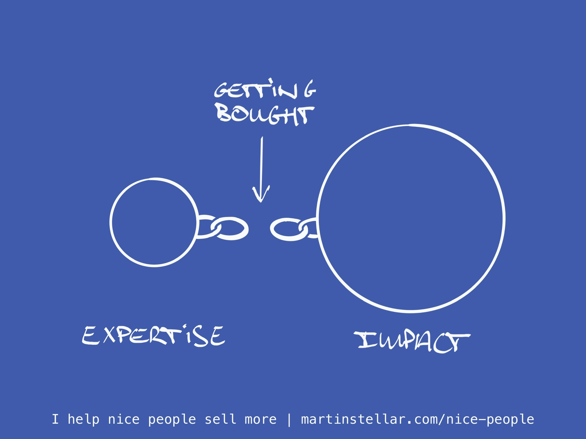

---
tags:
  - Articles
pubDate: 2024-08-26
type: sfcContent
location: 
cdate: 2024-05-03 Fri
imagePath: Media/SalesFlowCoach.app_The-missing-link-between-expertise-and-impact_MartinStellar.jpeg
podStatus: Published
episode: "39"
---

Of course, I get it: you have a whole bunch of experience, your expertise is through the roof, and the impact you deliver when you solve a client's problem is worth a lot of money.

Except for you to solve that problem, and get paid for it, your buyer first needs to become your client.

And for that to happen, they need to buy your work. That's the missing link between expertise and value.

Note how it doesn't say "You need to sell your work" but "your work needs to be bought".

Because that's the big switch that my clients and students experience:

It's not about 'selling', as in 'that thing we need to do to people', but instead it's about **making it easy to buy**.

Because things are bought, not sold.

So to get your work and your value into the life of your buyers, it's on you to make it easy, enable people to find you, and yes, enable them to decide "Yes!" and give you money.

Basically, your buyers need you to get good at selling, because if you're not, somebody else will be, and for the sake of your buyers, let's all hope that your competitor's work is as good as yours.

Because if not, you'll have underserved your buyer in not making it easy to buy your superior work, and let them go with someone sub-par, instead.

So, you know: if you don't learn selling for your own sake, learn it for your buyer's sake.

Learn selling, where?

[Right here](https://martinstellar.com/leap-ethical-selling-framework/)
