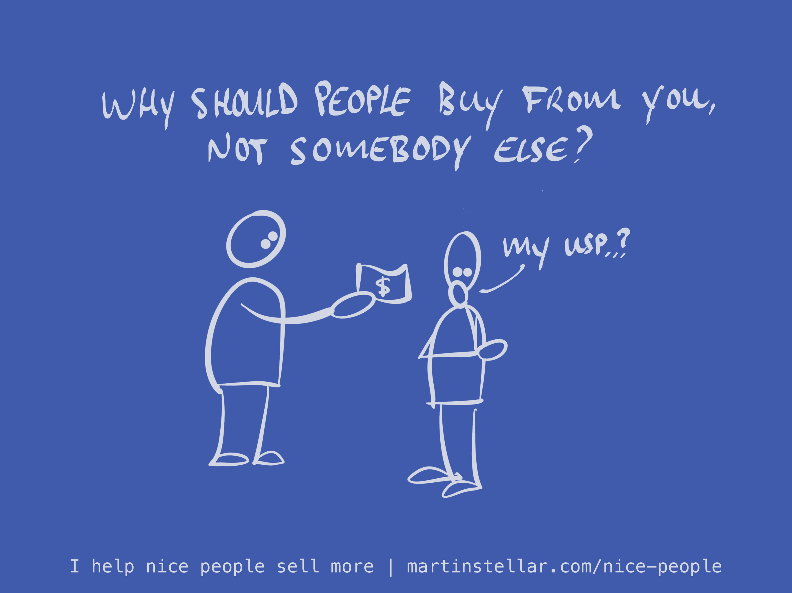

Last year I released [[👨‍🎓 Mini-training - Introduction to Stages & Ingredients of Business Growth (SIBG) Pt. 0.0|SIBG]], a mini-training on the different stages of business growth, the ingredients that go with each of them, and which ingredients to use... or indeed, to leave alone for the time being.

Fun fact: it's pretty safe to say, that every one of the ingredients are best left alone, until you've figured out the most important ingredient: Your USP.

Fail to understand your USP (which is the answer to "Why do - or should - people buy from you, and not someone else"), and it's very easy to make fatally costly mistakes, especially if you start trying growth or scale tactics.

For instance, it can be an attractive option to try lead-generation by running automated outreach campaigns, using LinkedIn or email marketing.

The problem with that is not that it doesn't get you leads - the problem is that it does.

But wait, we're in business, we want sales, and for that we need leads - right? 

Yes. But there's quality leads, and there's leads that are a complete waste of your time, for a number of reasons (no budget, no time, no urgency, no personality fit, etc etc).

So if you invest a few thousand dollars in advertising, and you drum up 20 leads a week, and you have to have a meeting with each of them... you'd better be damn sure that the majority of those people are actually qualified.

And this is where people often go wrong:

They focus so hard on generating leads in quantity, that they forget that efficiency comes from engaging with **qualified** leads - which, in the context of USP, are people who would prefer you over others...

If only you'd be able to communicate why you're different from others, in a way that clicks with them.

The result is usually frustration, wasted time, lost money, and a whole bunch of sales conversations that aren't ever going to go anywhere.

Put differently:

Don't look to scale up your efforts or your lead generation, until you've figured out your goto market strategy with predictable reliability, which necessarily means knowing with precision why people choose you, and not somebody else.

And for that predictability and reliability to develop, you need to do things that don't scale, especially if you want to discover your USP. Meaning: instead of driving lead generation at scale, start a research campaign, and learn your people first. 

Because that way you'll be so hands-on, that you get direct, live feedback on how well your targeting and messaging are working.

So if you're not 100% clear on your USP, schedule meetings with past buyers, and ask them why they chose you, with two simple questions:

"Why did you choose us, and not somebody else?

If you were to recommend us to someone, what would you say?"

Here's more info on how to conduct this kind of customer research, and how to [[👨‍🎓 SIBG Pt. 1.2 - How to define your value proposition, aka USP|figure out exactly what is your USP.]]

