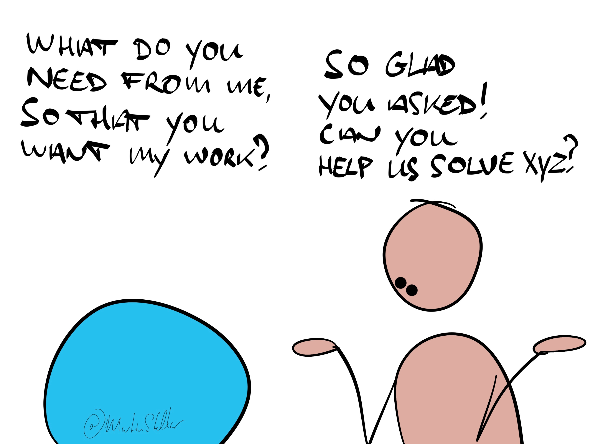

"Do you want to buy this, or not?"

Even if you don't actually & literally ask it from a buyer, it's the question you want them to answer, right?

Wrong.

That question - do you want this or not - makes it about you, and selling isn't about you.

So instead, ask:

"What do you need from me, in order to want to buy this solution?"

And yes, you can literally ask that directly.

But even if you don't, it's what you should be asking *yourself*:

What does your buyer need from you?

What do they need you to say?

What do they need you to ask?

What do they need you to know?

What does your buyer need you to take care of?

What does your buyer need you to guarantee, protect against, or take into consideration?

What promise do they need you to make?

The sale happens when you give the buyer that what they need, in order to want to buy your offer.

So whenever you go into a sales conversation or an email exchange or any communication, always ask yourself:

What do they need from you, in order to want to buy? What needs to happen, for this deal to move forward and become a sale?

In a similar vein: 

What is required, for you to move forward and [get yourself the 16-week Sales for Nice People training?](https://martinstellar.com/sales-for-nice-people-info/)

