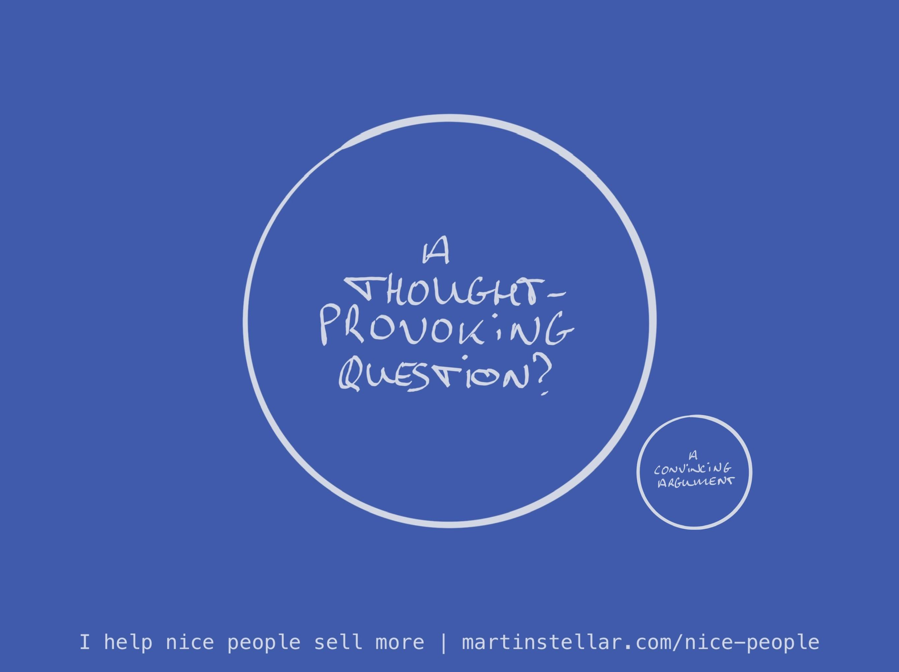

---
tags:
  - Articles
  - SalesForNicePeople
  - Conversations
pubDate: 2024-05-06
type: sfcContent
location: 
cdate: 2024-05-06 Mon
imagePath: Media/SalesFlowCoach.app_Thought-provoking-questions-beat-convincing-arguments-in-sales_MartinStellar.png
---

You can reason with people, create clever argumentation, pitch with a high degree of precision and accuracy and relevance, or...

You can simply ask pertinent, pointy, thought-provoking questions.

The former option gets you objections, psychological reactance, buyers who ghost you and deals that go stale.

The latter however, gets you buyers who are grateful that they had a sales conversation with you, and who reply when you follow up, and yes:

Thought-provoking questions get you sales, as well.

A good, well-considered and relevant question beats a compelling or convincing argument any day of the week.

This is terrific news for nice people, ethical entrepreneurs and business owners who operate out of values, because it means you don't need to do any of the salesy stuff, like pitching and convincing.

Instead, all you need to do is ask questions that help your buyer get clarity and get to a decision.

More good news?

You can learn exactly how to ask those questions that drive a sale forward, in a 10-week training programme, where you and I meet once a week and where I'll coach you on your deals as well.

The bad news?

It's not free.

But then again, neither is your work, and nor should it be.

In any case, the training comes highly recommended, not just by me, but also by Mairi Mickel, who said:

"I fully endorse Martin's sales programme for anyone serious about investing in winning more clients".

I'll leave that here, along with [the link](https://martinstellar.com/sales-for-nice-people-info/) where you can get yourself into the programme.

In any case: [[📄 Never convince, never persuade|Don't convince, don't persuade]]. Ask your buyer questions, instead.

Cheers,

Martin
