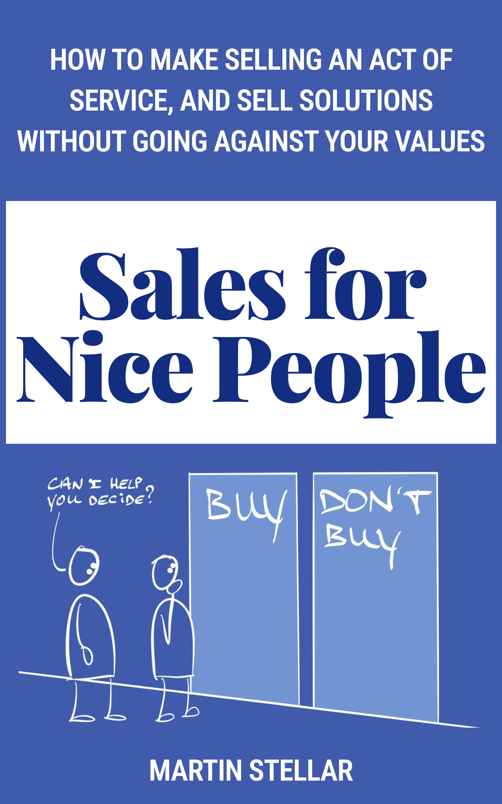

---
tags:
  - Articles
  - SalesForNicePeople
  - SFNP-book
pubDate: 2024-09-30
type: sfcContent
location: 
cdate: 2024-09-30 Mon
episode: 
imagePath: Media/Sales-for-nice-people-book_MartinStellar.png
---

Had a chat with a friend on Friday, and I showed her the book cover you see here. 

She spotted something that I hadn't: to her the words on the door don't read: "Buy" and "Don't buy". 

To her, they look like:

"Bully" and "Don't bully". 

And yes, my lettering is imperfect, so I figured I'd redo the drawing. 

But then I thought about and realised:

No actually, it's perfect as it is. 

Because let's face it: 

A lot of the selling we see people do, is basically nothing more than guilting, shaming, and yes, bullying people into making a purchase. 

Convincing, persuading, forcing a buyer into a logical box, based on a script that a sales person reads off dozens of times a day...

It's not that sales as an industry is wrong: it's that there's so many stilted, unethical, manipulative bad practices. 

And I stand against that, and that's why this book (almost) exists. 

Because yes, the manuscript is ready, the design too, the ePub file works across devices, and with all that out of the way, today begins the process of dealing with logistics and distribution. 

And that means that in the next few days, you should be able to get your hands on a copy of Sales for Nice People - [a free copy even, if you sign up to the launch list](https://martinstellar.com/book) and follow the instructions I'll be sending you. 

Meanwhile, you and me, we're probably on the same side of the fence: Don't bully. 

