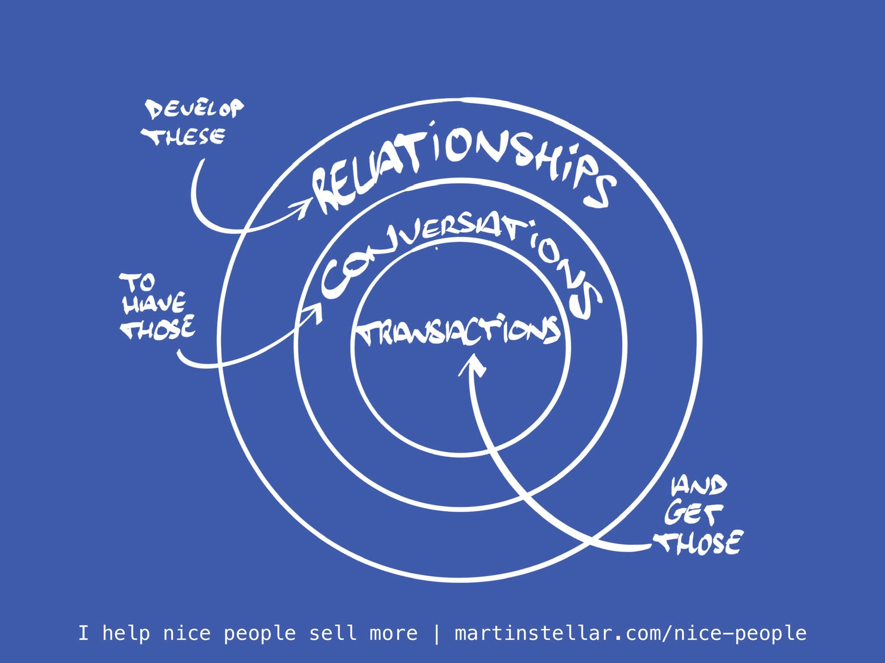

 

Well, no. If you look at things that way, you make it transactional.

And that means you’re likely to ignore a host of items that matter a lot to your prospect.

Wants, aspirations, fears and frustrations… trust and concerns and objections…

All kinds of things that are very much alive in your buyer’s mind.

And, until your buyer has a resolution to all of those - meaning you have to have those things on your mind as well - there will not be any transaction, because your buyer won’t be ready.

The thing to remember is that a sale happens in the context of a conversation, and a conversation happens in the context of a relationship.

So if you find that prospects don’t end up buying, even though they seem ready, willing, able and in need, ask yourself:

Are you focused on the transaction, or on the relationship?

In nearly all cases, backing away from the transaction you hope for, in favour of developing the conversation and the relationship, will enable your prospects to bring items to the table that they need resolved.

Whereas if you keep your focus on the transaction, they’ll feel incomplete and they'll very likely not share everything that's keeping them from buying.

For them, there will be something missing in the overall picture - and as long as that state exists, they’re not going to buy.

Relationships lead to transactions.

So: Build relationships, in order to [[📄 What do I do when a sales conversation doesn't go anywhere?|have the kind of conversations that lead to the sale]].
