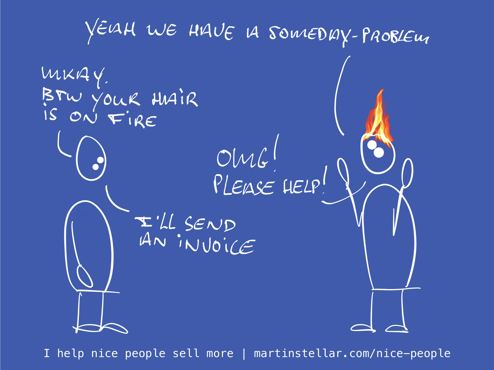

---
tags:
  - Articles
  - ProblemCost
  - Urgency
pubDate: 2024-12-18
type: sfcContent
location: 
cdate: 2024-12-18 Wed
episode: 
imagePath: Media/SalesFlowCoach.app_Triage-question-4-How-urgently-do-they-need-a-solution_MartinStellar.jpeg
title: "Triage call Pt 4: How urgent is this solution?"
---
> [[🏋️ Trainings]] >> [[📄 Triage call Pt 4 - How urgent is this solution?]]

You can't get the sale if to your buyer, you're a someday-solution.

It's blatantly obvious, because people most people tend to buy the umbrella when it rains, not when the sun is out.

Yet many coaches and consultants happily fritter away their time talking to buyers about their pretty and sturdy umbrella, while their buyer is walking around in shorts, flip-flops and a Hawaiian shirt.

Of course you don't sell umbrellas and your buyer probably doesn't wear Hawaiian shirts while talking to you, but just the same:

If your buyer is kicking tyres, or exploring options for next year, then you trying to get them to hire you is a waste of time and a net loss of ROI on the time you spend on business development and sales.

So, the sooner you can figure out that they have a someday-problem instead of a now-problem, the sooner you can move on to people with now-issues and get those people to buy from you.

So, ask your buyer these three questions if you're not sure they need help now or very soon:

**What does enough look like?**
When will you've had enough? When will it be the time to solve the problem?

What's the trigger that's going to make you decide that you should solve this now?

This will help your buyer properly project a solution on a timeline: either someday, or now.

Only in the latter case does it make sense to keep talking to them.

**Can you afford to keep paying for the problem?**

Yes, yesterday's chapter about the size of the problem asked the same question, and it's repeated here because paying for a problem holds two components:

One is [[📄 Purchase motivators - Problem-cost and urgency|the cost of paying for keeping it]], the second is the question of whether or not to keep on paying that cost into the future.

Which then neatly leads into the next question:

**If not now, then when?**

This question is an act of service to ask, because indecision causes your buyer to keep on paying the problem-cost, and it's helpful to get them to clarity about whether or not that cost is acceptable or not.

If it isn't, then it's your duty of care to make them aware of it.

And it's really effective. I've had buyers go from dallying to "Here's the money" overnight, after sending them an email with that question.

Next up tomorrow in the Triage series: [[📄 Triage call pt 5 - In what way will you personally win when this gets solved?|What's the identity piece?]]