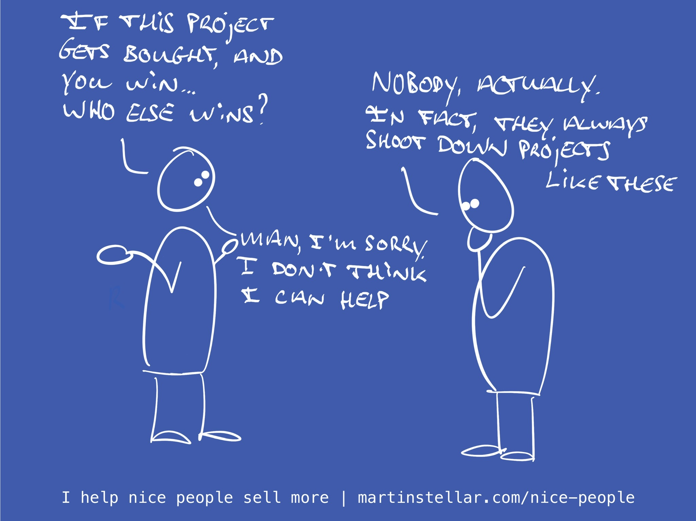

---
tags:
  - Articles
  - Triage
pubDate: 2024-12-20
type: sfcContent
location: 
cdate: 2024-12-20 Fri
episode: 
imagePath: Media/SalesFlowCoach.app_Who-else-stands-to-win-when-this-gets-solved_MartinStellar.jpeg
title: "Triage call Pt 6: Who else stands to win when this gets solved?"
---
> [[🏋️ Trainings]] >> [[📄 Triage call Pt 6 - Who else stands to win when this gets solved?|Triage call Pt 6: Who else stands to win?]]

Next in the Triage Call mini-training:

When your buyer gets your solution, and it causes them to win and step into a new identity...

Who else would stand to win?

In their organisation, who would be helped, unlocked, get unstuck, be enabled to do more fun and lucrative things for the business?

Because a business is a complex socio-psychological thing, and there's many relational elements tied in with the decision to buy or not buy from you.

It's never just about your buyer and their identity and what gets enabled:

The people around them will also experience the effects of your work.

Maybe you fix conversion rates on an ecommerce site, and now suddenly the cash register keeps ringing and there's more funds to invest.

That means new projects could get started, or the company can start looking for a new round of funding, or people could finally get promoted, or HR can start hiring...

So asking your buyer about the way others will win can be extremely helpful for making a deal move forward.

Or... it might reveal exactly the opposite.

It just might be that you discover that no matter how much your buyer wants your work, selling it into the company is going to be a major struggle.

Because while your buyer wants others to win, you learn that in their particular company, consultants like you often don't get hired, because James at HR always yells about how the teams is already dysfunctional enough, or Jennie at Finance never unties the purse strings, or your contact actually has no sway in terms of bringing people like you through the door.

And if that's the case, you might love the company and really want to work with this buyer, but the harsh reality is that it's going to be an uphill battle.

And you know what that means, in the world of Sales for Nice People?

[[⛏️ MYNO = Mine Your Network for Opportunities|Close the file and move on. Next!]]

But wait, is that a nice-people thing to do?

Drop the opportunity and let that super-friendly buyer that you really want to help, out in the cold, living on with the problem you're not going to solve?

Well yeah, because the chances that you'll land the deal and get to help are slim...

And while you're there trying to somehow figure out how to get around the problem, there's another buyer out there where you do stand a chance with, except you're not talking to them because you're banging your head against the door of the wrong company.

So you won't get the sale from Dysfunction Inc. and not from HelpUsPlease.com either, and you're not solving any problems for anyone. Look at you being a nice person.

So, ask your buyer:

**Who else gets to win, when this gets solved?**

If the answer is "nobody", or reveals that dysfunction or misalignment will block your deal, or otherwise makes the deal look implausible: Park them for later, and move on. There's plenty of buyer-shaped fish in the sea.

Next up: [[📄 Triage call mini-training pt 7 - What would you like us to do next?]]