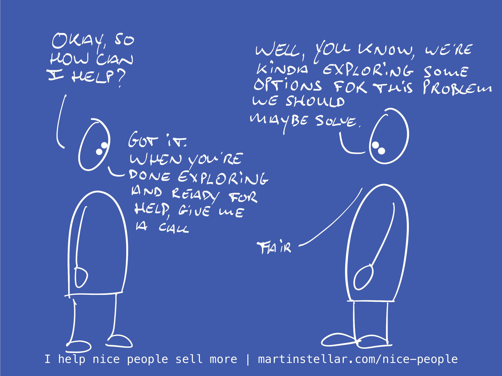

---
tags:
  - Articles
  - Triage
  - Problem-stack
pubDate: 2024-12-12
type: sfcContent
location: 
cdate: 2024-12-11 Wed
episode: 
imagePath: Media/SalesFlowCoach.app_Triage-call-question-1-What-is-the-problem_MartinStellar.png
title: "📄 Triage call Pt. 1: What's the problem?"
metaTitle:
---
> [[🏋️ Trainings]] >> [[📄 Triage call Pt. 1 - What's the problem?]]

When you have that first conversation with your buyer, it's extremely important to get a proper read on the problem they're looking to solve.

Because when a buyer shows up saying their team isn't performing and deadlines are being missed, there's a lot of unknowns in there, there's ambiguity and the definition of the problem is fuzzy around the edges.

If you then start your first call without getting some clarity and definition, you're setting yourself up for ghosting and a lost deal.

Because who would want to buy a solution to a problem that isn't properly bracketed and defined?

If there's not sharp and clear image of what the problem looks like, how can you possibly expect your buyer to want to keep talking to you and meet again?

Whereas if you have a well-defined, snippy definition of the problem, your buyer leaves the conversation knowing that you understood the problem, and that automatically has them consider you as capable of solving it.

So to turn your first conversation into a future sale, it's essential that you define a first version of [[📄 What's their problem-stack?|the problem-stack]] - that neat and tidy set of interrelated problems that make up the overall bigger problem.

Another reason: what if the problem includes components you're not qualified to solve? Or aspects you just don't want to work on?

You wouldn't be the first consultant who gets brought in to stabilise revenue, only to find after getting hired that the team is dysfunctional and you get dragged into mediation and conflict-resolution stuff... and that might just be the kind of work you really don't want to do.

So, in your very first buyer conversation, get some clarity on the shape of the problem, in function of answering the question: Does it make sense for us to meet again?

Here's a few questions you can ask to help you get that initial clarity:

**What made you decide to meet today?** ^61c0aa

This will have your buyer introduce you to the problem, and give you a basic insight into what kind of help they need.

Then, you can use the coaching question to get to the heart of the matter:

**What is the real issue here?** ^ea87ca

This question is helpful, because it forces your buyer to dive a little deeper, and go beyond the presenting problem. It'll reveal aspects that might cause you to decline the gig, and you'd better find out about those aspects as early as you can.

Then, start having them define the why of solving the problem:

**What is important about solving that?** ^c9f641

With that question, your buyer either start building up a case for ultimately hiring you, or...

It will have them admit that the problem is there, but not yet something important or urgent enough to solve.

In which case you're talking to a shopper, not a buyer, and that means you either wave bye-bye, or you agree to meet at a later stage, when the problem has gone from a someday-problem to being a now-problem.

In any case, use that first conversation not to sell the next meeting, and not to sell yourself on the idea that this is a qualified buyer:

Use it to triage the opportunity, and figure out whether or not you should continue to engage with this buyer in the first place.

Next: [[📄 Triage call Pt. 2 - What's the unlock?]]