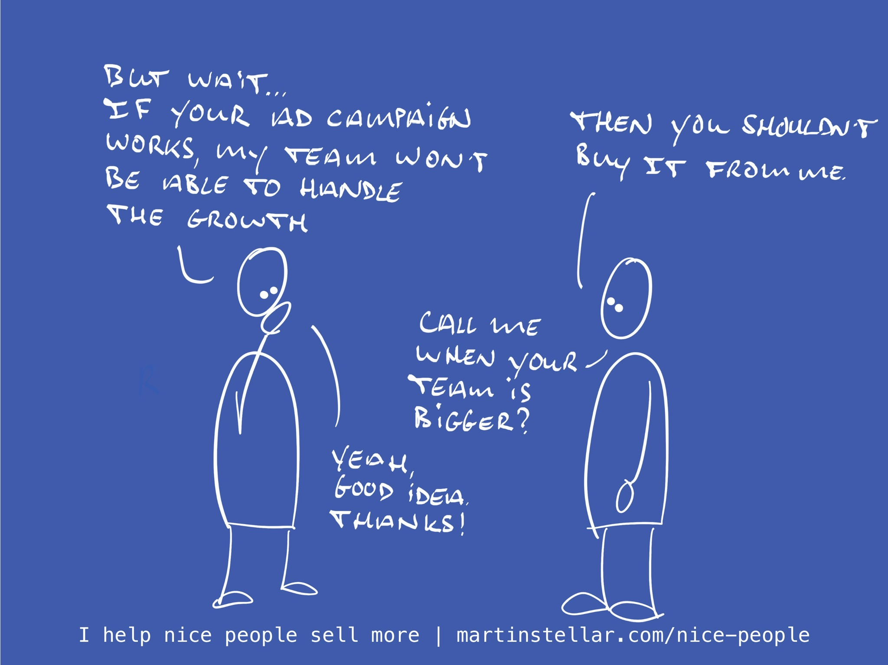

---
tags:
  - Articles
  - Triage
pubDate: 2024-12-16
type: sfcContent
location: 
cdate: 2024-12-13 Fri
episode: 
imagePath: Media/SalesFlowCoach.app_Triage-call-question-2-what-is-the-unlock_MartinStellar.jpeg
title: "📄 Triage call Pt. 2: What's the unlock?"
---
> [[🏋️ Trainings]] >> [[📄 Triage call Pt. 2 - What's the unlock?]]

When you do a great job for a client, you don't just solve the pressing problem that they're hiring you for:

When a coach or consultant or service provider really knows their stuff, there's usually a number of other things that get solved or improved or enabled as well.

And when you can have your buyer identify those secondary results, it's going to be much easier for them to convince themselves that buying your work is a good choice.

And obviously, it's much nicer to let a buyer convince themselves, instead of you having to try and figure out how to convince them. (Also see: [[📄 Never convince, never persuade]])

So when you have that first call and you're triaging the opportunities to figure out whether or not you ought to keep engaging with this buyer, focus their attention on the potential additional outcomes, with the following four questions:

**When you solve this problem, what opportunities for growth will that unlock, as a side-effect?** ^42dad0

This will have your buyer look beyond the obvious, front-facing solution, and create a bigger-picture view of what you'll solve for them.

**What bottlenecks will be removed when we solve this for you?**

This question is useful because every business will have bottlenecks, and the problem with bottlenecks is that they often go from "We need to fix this" to "We'll fix this sometime in the future".

For you to let your buyer identify which bottlenecks can disappear, that they've resigned to, can massively increase the perceived (and real!) value of your work.

**What would get unstuck when you buy this solution?**

A close cousin of bottlenecks, things that are stuck often also end up on the someday-pile, causing a business to end up with increasingly large amounts of operational or organisational debt.

Put differently: getting things unstuck is often too costly, or they stay stuck because there just isn't enough time to get them unstuck, and so a company ends up living with inefficiencies.

Get your buyer to parse what your work will do for them, and in what way your solution will help get things unstuck.

**What will speed up?**

This question will help your buyer look at how your work might grease the engine of their business, and it's an important question to ask, because:

In many cases, growth, unlock and speeding up actually brings along a problem for your buyer (aka [[📄 Are you selling them a problem? Mini series Pt 1 - congruently desirable offers|adoption-cost]])

Yes of course, they want to scale, sell more, have more impact, be a more productive team and what have you...

But many sales that look like they should happen don't happen, because causing speed and growth and scale would result in new problems, and then that becomes the reason they don't buy.

For instance, a software company that buys a project that successfully increases conversion will also have to deal with far more support tickets and feature requests, and if the team is small and not able to handle that extra volume, then it's very possible that the expectation of more buyers is the very reason they don't buy.

So when you ask the speed-up question and you identify that the adoption-cost would be too high, that opportunity isn't a qualified buyer, and you might have to let go and move on to the next opportunity.

Next up in the Triage-call series: How big of a problem is this, really?
Next: [[📄 Triage call mini-training Pt. 3 - How big of a problem is this, really?]]

---

If these emails are helpful but you want more results and a faster way to improve your sales, [Sales for Nice People is the way to go.](https://martinstellar.com/sales-for-nice-people-info/)
