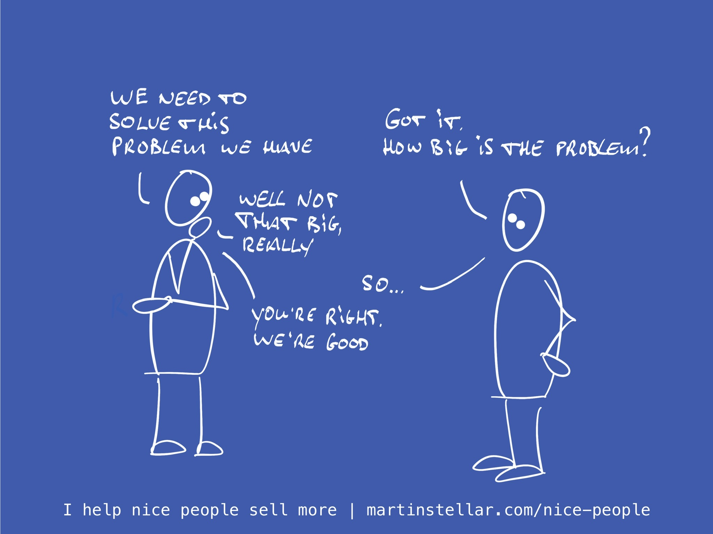

---
tags:
  - Articles
  - Triage
pubDate: 2024-12-17
type: sfcContent
location: 
cdate: 2024-12-17 Tue
episode: 
imagePath: Media/SalesFlowCoach.app_Triage-Question-3-How-big-is-the-problem_MartinStellar.jpeg
---
> [[🏋️ Trainings]] >> [[📄 Triage call mini-training Pt. 3 - How big of a problem is this, really?]]

When a buyer shows up with a problem and a need for help, and it's the type of problem you're qualified to solve, it's easy to jump straight in and try and show them all the wonderful ways you can solve or remove it for them.

I mean, here is someone who is struggling, and you have all the skills and tools, the team and the years of experience, and all they need to do is just sign the contract and then you can proceed to do ply your craft and make their life better.

Except they don't proceed to checkout, they're not ready to schedule a next meeting, they don't get back to you like they said they would, and they don't reply to your followup either.

What the hell happened?

Didn't they need your help? Surely they didn't go to a competitor, did they?

Well they might have, but that competitor is probably getting ghosted just as hard as you are.

So then what actually happened?

Well, very often what happened is that you didn't realise that while their problem is indeed painful and in need of a solution, it's just not a painful enough problem to actually buy a solution for.

Which makes sense, because not all problems are big enough to warrant solving.

Sure you can take your car to the shop and get that cup-holder fixed, but if your commute is only 10 minutes and you never drink coffee in the car, the broken cup-holder just isn't a big enough problem. In fact, it's barely a problem at all.

And if you're a coach or a consultant and your buyer says "We have all this data that informs our decisions, but we think we could make better decisions if we had a better suite of analytics", you might think you have a ready buyer on the call, but it's quite possible that the problem is just not big enough to solve.

Yes, it's a problem. But it makes perfect sense that they'd rather put up with the problem, rather than pay up for a solution.

In other words: we're talking about the '[[📄 When price is your buyer's objection, give the 'put up or pay up message'|pay up or put up]]' distinction.

And yeah, if they'd rather put up then pay up, your opportunity is not qualified, your buyer gets to enjoy their problem a little while longer, and under no circumstance should you then try to push the sale forward, because it just ain't going to happen.

You can't sell a rescue mission to someone who struggles to swim. For that, you need someone who is drowning.

And if your buyer isn't drowning?

Then don't try to rescue them, but move on and talk to someone who is in bad and dire need of a solution.

So, to figure out the size of the problem and whether or not it's actually is a big enough problem to solve, ask your buyer these three questions:

**If you were to do nothing at all about this, how big of a problem would that be?**

**Can you afford to get rid of the problem?**

And, the final qualifying question:

**Can you afford to keep the problem?**

When you ask those three questions, you'll either get a very clear: "Thanks for your time, we're good for now", or you'll get a promising and workable "We do need help, how does it work?"

And only when you get that second response, does it make sense to schedule a next meeting and pursue the sale.

Next up tomorrow: How long are you willing to pay for keeping the problem?

Next: [[📄 Triage call Pt 4 - How urgent is this solution?]]