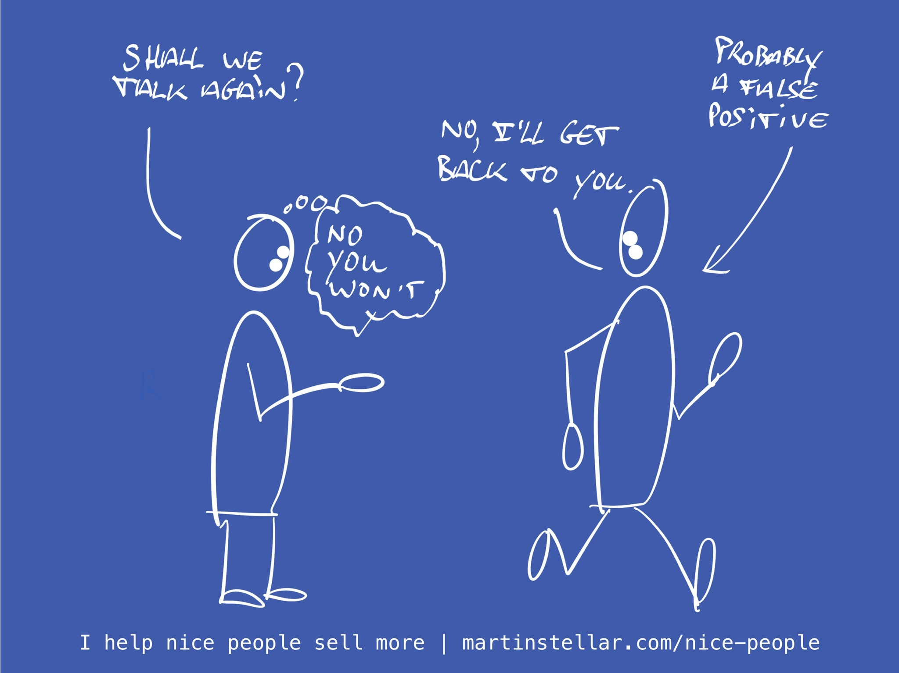

---
tags:
  - Articles
  - Triage
  - NextActions
pubDate: 2024-12-23
type: sfcContent
location: 
cdate: 2024-12-23 Mon
episode: 
imagePath: Media/SalesFlowCoach.app_Triage-questions-whats-next_MartinStellar.jpeg
cssclasses: 
title: "Triage call Pt 7: What would you like us to do next?"
---

If I could get you one thing for Christmas, it's this: 

To have fewer buyer conversations that don't lead to a sale, and fewer opportunities that look like 'gold in them there hills', but that actually are false positives. 

And that's precisely why I've been posting this triage series, so that starting 2025, you can faster [[📄 Why you should clean up the deadwood and get rid of deals|disqualify deals that aren't worthy of your time]]. 

So to wrap that series up, here's the final litmus test for assessing whether your looking at a deal or a dud: 

Is your buyer ready for a next action?

Because even if everything else checks out and the previous questions all give you great positive insight about your buyer's needs and urgency and so on, if they're not willing, ready or able to take next actions with you, then you're not going to get a cigar no matter how hard you try. 

Obviously, the best next action is when people send you money or sign a contract, but that rarely happens after the first call. More conversation is usually needed, so it can make sense to ask: 

**Would it make sense to speak again next week?**

Or, if you're not quite sure how keen they are, flip the question into 'asking for no':

**Would it be a bad idea to speak again next week?**

Of course in many situations, that would be too forward, and be perceived as too aggressive. 

In that case, hand your buyer their autonomy, and let them decide what's next:

**What would you like us to do next?**

Now, they get to choose the next action. Which hopefully is 'let's talk again', but if that's not what they say, and they're not committing to following up with you either, you might have a deal that's blocked right from the start. 

Of course you can then say that you will follow up later, but that leaves you with a bad situation: 

You don't know where they're at, whether they'll want to buy or not, or indeed whether or not they'll reply to your followup. 

Which then either means you just stop trying, or you end up [[📄 Farm, don't hunt (sales for nice people)|having to chase them]], which is a bad idea. (In Sales for Nice People, we farm - we don't hunt or chase). 

So if they don't tell you what the next action should be, ask them the 'bad idea?' question. 

If they then won't book a next call with you then and there, you just might have a dud opportunity on your hands, and I'll bet you have better things to do than try and work on unlikely deals. 

Note: I'm not presenting this as hard rules: sometimes, a buyer does want to meet again, but there's reasons why they can't pick a time right then, so you'll need to feel your way through the situation at hand. 

But more often than not, trying to agree on a next step with your buyer will reveal that while you might want to move things forward, they don't. And when that becomes clear, you gotta move on. Life's too short. 

And that's it, as far as my Christmas present for you is concerned. Have a good one. 

Coming up next, a new mini-series, on how to 'price your work above resentment'...
