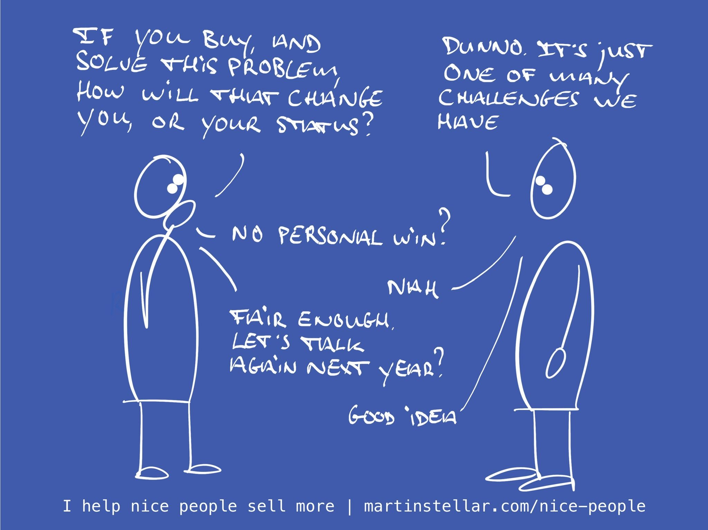

---
tags:
  - Articles
  - Identity
  - Triage
pubDate: 2024-12-19
type: sfcContent
location: 
cdate: 2024-12-19 Thu
episode: 
imagePath: Media/SalesFlowCoach.app_Triage-questions-what-is-the-identity-piece_MartinStellar.jpeg
title: "Triage call pt 5: In what way will you personally win when this gets solved?"
---
> [[🏋️ Trainings]] >> [[📄 Triage call pt 5 - In what way will you personally win when this gets solved?|The Triage call pt 5: the identity piece]]

Next up in the triage series: What [[👤 What change in identity will take place when they buy?|change in identity]] will take place if your buyer buys from you and in doing so solves their problem?

I've often written about that identity piece, because once you get a buyer to recognise what next version of themselves they will acquire, it becomes a lot easier for them to decide that yes, they want your solution.

And where it comes to triaging your opportunities early on, it's useful to ask them the question.

Because in doing so, and having your buyer explain to you how the way they see themselves will change, and how other people's perception of them will change, you just might find a hidden deal killer.

Meaning:

When you have the identity conversation, it's not uncommon to discover that actually, not all that much will change.

Sure they might get your website with ecommerce built in, and then their operations will run more smoothly and profitably, but, beyond that? Business as usual, just another component they need to invest some money into.

And that means that buying that website is pretty much a trifling issue. Necessary perhaps, but just one of the many things on their plate.

In other words: a commodity, and that makes you the provider of a commodity.

Which doesn't mean that you should immediately disqualify the opportunity, but it does mean that the deal is much less important and meaningful to them, than it would be if your buyer really needs the website, because it would finally unlock growth, and that would make the buyer a hero to the team, their spouse, and the investors.

So when you have your first conversation, try and get a read on whether or not there is a shift in self-view and identity tied into getting the solution.

You can even ask them explicitly:

In what way will buying this solution change you on a personal level? What's the personal win? How will it change the way you see yourself, or how others see you?

If the answer reveals buying really would be like buying a commodity, then it might be wise to mark this deal as a B-type, and focus your time and energy on landing A-type deals, where getting a solution is important and meaningful.

Because in the end, life is too short to try and sell your work to people who would like to have your work, instead of trying to land clients who absolutely must have your work.

Coming up tomorrow:

[[📄 Triage call Pt 6 - Who else stands to win when this gets solved?|Who else is going to win, beside your buyer...?]]
