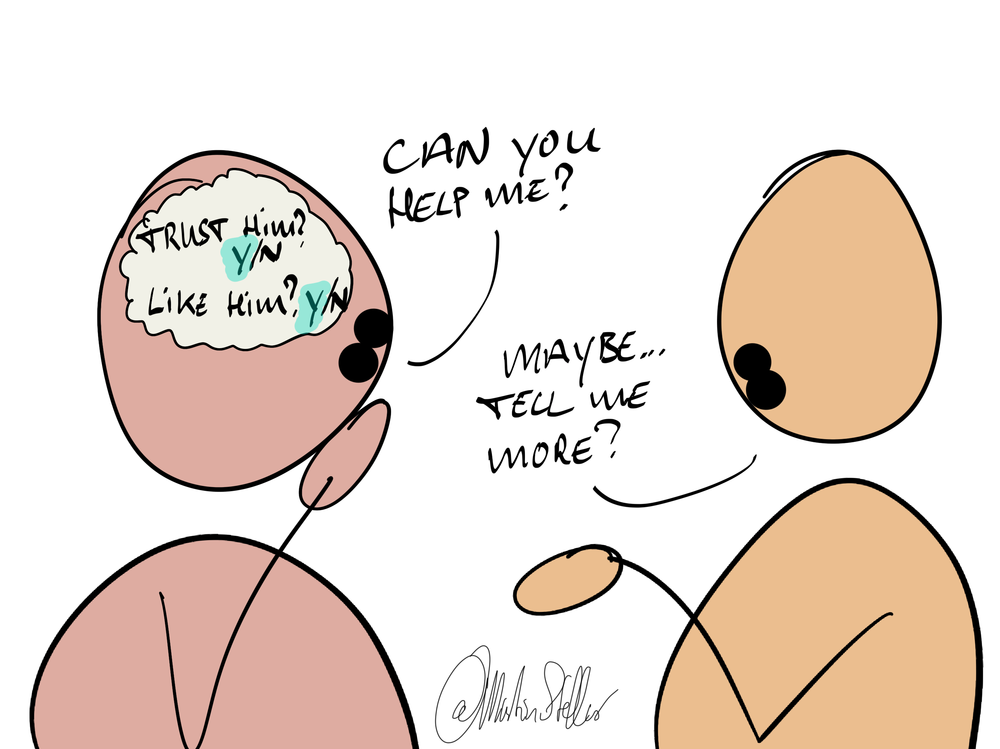

---
tags:
  - Articles
  - Problem-Cost
  - Trust
  - SalesConversations
  - EvolutionaryPsychology
cdate: 2022-12-27 Tue
pubDate: 2023-12-19
title: 📄 Three questions that determine whether or not they'll buy - and the second one gets way too little attention
type: sfcContent
imagePath: Media/SalesFlowCoach.app_Know-like-trust-how-to-generate-trust_MartinStellar.png
---

Yes, of course: people need to know you, like you, and trust you, if they’re going to buy your thing.

``

But Know, Like & Trust, aren’t enough.

On a very primal psychological level, evolutionary style, everyone subconsciously asks three questions when dealing with others:

"Do I like you?"

"Can you help me?"

"Do I trust you?"

And that middle part - the other's _belief_ in your ability to help - is something often overlooked.

Think about it:

A buyer needs to have the conviction, the belief and the confidence, that you can help them solve their problem. Without that, they'll never buy.

But saying that you can do X or Y for them doesn’t cut it. You can't convince someone into believing what you say.

Whether you say "I make a good breakfast" or "I fix your SEO" or "I help you get really good at enrolling buyers" (that would be me), it does nothing to convince someone.

It’s data, information, a statement.

For someone else to actually *believe* that you can help them, to **trust** that it’s true, something has to shift in their mind.

A doubt or question needs to be addressed in such a way, that they go from "Can they help me?" to "Oh wow, they can!"

Saying it won’t make it happen.

Persuasion doesn’t make it happen.

Nor does a list of awards, education, resume or bio or impressive client portfolio.

For a buyer to believe that you can help, they need to have an *insight* that leads to conviction.

They need to **know**, that yeah, you’re the guy or gal for the job. And when that moment arrives, it comes in the shape of an epiphany.

And when that epiphany arrives, that when people get themselves ready to buy. No persuasion required (which is why I say: [[📄 Never convince, never persuade]].

So if you can't get there with reason, or persuasion or convincing, is there nothing you can do to have a buyer go through that process and reach that trust?

Sure there is:

1: Have a conversation, and frame it as an exploration into goals, current situation, and any gaps or obstacles inbetween those two.

2: Sell them on one thing only: *your care and concern for them* as a person and as a business owner. Be genuinely interested, in finding out exactly what their needs are. [[📄 Sell Stewardship|Be a steward over their situation and their outcome]].

3: Ask questions that invite the other to try out different perspectives, including the perspective of getting your help in solving the problem.

That way, one of two things will happen: your buyer will either realise that no, you're not the droid they were looking for, in which case you can both move on, or:

They join you in an exploration of what your help would look like, how it would work, what it would cost, and, very importantly, what it would cost to *not* get your help (i.e. [[📄 Purchase motivators - Problem-cost and urgency|problem-cost]].)

If that buyer is right for you, and you are right for them, they'll automatically develop their own belief that yes, you can indeed help them. And that's when your buyer enrolls themselves.P.s. Do you enjoy these emails, do you find them helpful? Then why not pick a few friends, and give them the gift of articles like todays'.