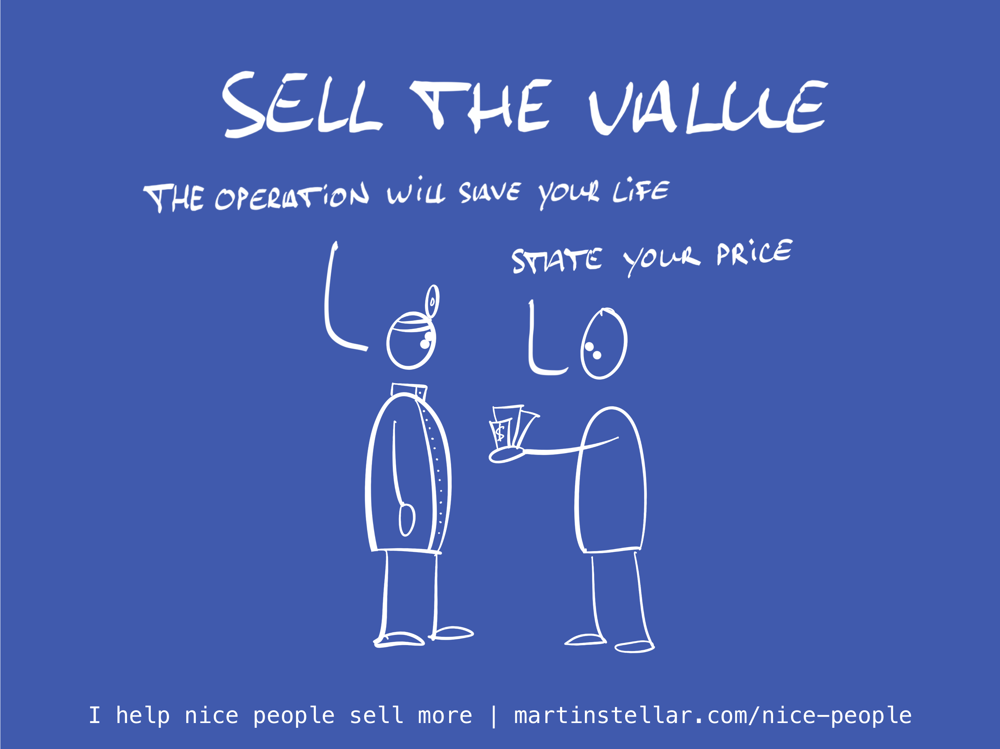

---
tags:
  - Articles
pubDate: 2024-10-02
type: sfcContent
location: 
cdate: 2024-09-05 Thu
episode: 
imagePath: Media/SalesFlowCoach.app_Sell-the-value_MartinStellar.png
---

You might think that what you charge for your work is fair, or that it's all that the market can bear, or that making your work affordable is a good idea, but I rarely, if ever, meet service providers who charge what their work is actually worth.

Nearly everyone should charge way, way more than they do, and I'll bet the same goes for you.

"But Martin", is often the argument, "I don't want to be greedy!"

Nor should you be.

But charging high prices isn't about greed. It's about getting paid for what your work is worth.

And that worth has absolutely zero to do with how much time you spend, or what your qualifications are, or your margins.

What your work is worth has to do with value to society.

Consider:

Back in 1990, the behemoth General Electric was valued at 500 Billion dollars.

Fast forward 30 years, and the company was 'only' worth $100 Billion.

Can you imagine how many jobs were lost, how many mortgages weren't paid, how many cars were repossessed, how many kids didn't go to university... how much damage was done to markets, industries, factories, lives, and the generations that follow those lives, simply because GE shrank from 500 to 100?

It's enormous.

If the right firm or consultant had come in at the right time, to prevent the massive losses, the overall damage could have been much smaller.

And that firm or consultant, for creating that kind of impact and providing that much worth, trickling down for generations, would have been completely justified in getting compensated on a level commensurate with the value they created.

Now I don't know if you work with half-trillion behemoths, but if you read my stuff I'll bet you deliver spectacular quality work, and I'll bet that the overall worth of your work is much greater than what you charge.

So while you might think that charging $100, $200 or even $500 per hour is fair, I challenge you to think about what your work actually does for your client and the stakeholders in their world.

Because very likely, you too charge way too little.

And if that's the case, there's two ways to get paid more:

The first is to sell projects based on value, instead of charging by the hour.

Because when you charge [[📄 Values vs Value (Your Marketing Narrative)|based on value]], you make your buyer weigh the total cost of your work against the total value of the outcome you deliver, instead of forcing them to do mental accounting and trying to keep your number of hours to a minimum.

Which makes it much easier to charge the kind of high prices that your work is worth.

The second way to earn more for your work, is to learn how to use [Sales for Nice People](https://martinstellar.com/sales-for-nice-people-info/), the selling methodology I created, based on empathy and integrity, and which helps you sell based on value.

Either way:

Charging low prices means you undervalue yourself, and it might just be the best way to do your clients and society a disservice.

Cheers,

Martin

P.s. If the above is true, then why is SFNP a 16-week one on one programme, at only $1490?

Do I not practice what I preach? I sure do, but SFNP is a loss-leader, intended to make it easy to start a paid working relationship with ambitious service providers and consultants, enabling you to sell more and earn more, so that afterwards we can start into larger, more involved projects.

Anyway, for those who are fed up with undercharging, [SFNP gets you out of that situation. ](https://martinstellar.com/sales-for-nice-people-info/)