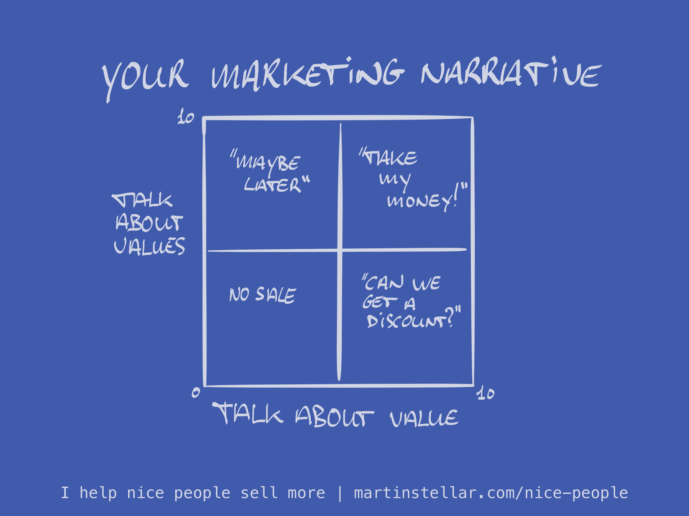

A few years ago, I lost a fairly big sale to a company I would have loved working with:

They’re developers, they’re dead smart, their software absolutely rocks, and they have their heart in the right place. Just awesome.

We’d settled on a coaching programme and a price, for me to help them build out a content campaign around the CEOs story, intellectual property & personal values.

Everybody on the team was on board with the idea, and all systems looked go.

But then I received a message saying they declined the project, because they wanted to take a different approach:

"We’d rather promote our software based on its value, instead of based on our values”.

And yes, that might work. But how well would that kind of marketing work, if it's only about value and quality?

Because no matter how good a thing is, that’s not enough for people to flock to it - not in a viral or exponential way.

Quality (i.e. value) sells, but it does not sell itself. Which you've probably noticed. 

So if all you’re doing is selling on quality, you miss out on an emotional connection your audience can have with you, your brand, and what you stand for.

And if you want that emotional connection, because you're aware that it helps increase sales, then leading with values is the single best way to create it.

I believe it fits in with Seth Godin’s **[[📄 Lead With Values and Sell More Because of Them|people like us, do things like this]].**

"People like us" means, among other things: People who have the same views and values as I do.

Creating that kind of click with an audience, where you both feel a kind of kinship, that’s massive for rapport and buy-in.

But if you only speak of value and quality, you’ll be perceived as just another provider, shouting into the void, pitching on how much value you can bring.

And, you'll be wondering why people won’t pick up your quality the way it deserves.

Whenever people meet a person or product or service, they need three questions answered, as per Chris Voss, the negotiation expert:

Do I like you?

Do I trust you?

Can you help me?

When you speak of value and quality, you answer the second and the third question - but not the first.

And no matter what marketing or sales channel you use, you’ll get a ton more ROI on your efforts if you give people a reason to like you, based on shared values, on what you both stand for and stand against.

Quoting myself again: Lead with values.

