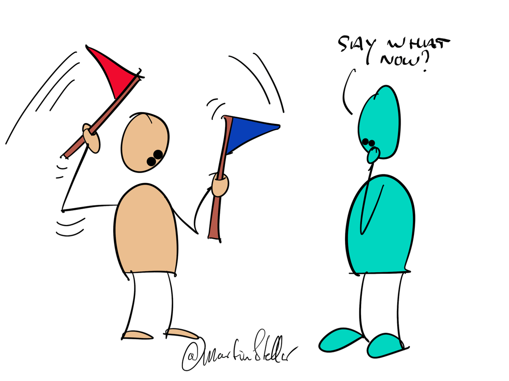

It's said that everything is marketing, and that's very true.

On a much deeper level though, **everything you do is a signal**.

Proper listening signals to the other: you and your story matter to me.

The husband hiding behind his newspaper or being glued to his phone screen signals: you’re not a priority.

Sending out useful daily emails signals: I’m not just in it for the money, I intend to serve as well.

(Have you started daily emails yet? I highly recommend it).

Lashing out at someone signals: my state of upset is more important than harmony, collaboration or understanding.

Everything that you do in your life sends some sort of signal to others.

The problem is that in 99% of the cases, we’re unaware of what signal we’re sending, or how it's being perceived.

We go about our business, act as best as can, but we don’t stop to think what message, or signal, we’re broadcasting.

And then it gets worse, when we don’t stop to notice how our signal is being perceived.

This is the cause for a huge number of problems in relationships (business or personal) and in society as well.

But it’s so easy to see! People literally tell us how our signals are being perceived!

Whether by how they respond, or body language, or action, or inaction: your world gives you constant and direct feedback on how well your signals are working for you.

The trick to getting better results with people - and more sales - is to step out of your silo, and to open up to the signals that are being returned to you.

The responses to your own signals: those are what tell you *what it is that you actually said.*

Because what you think you said, or intended to say, is nowhere near as important as [[📄 A Lesson George Bernard Shaw Wants You to Learn|the message that got heard.]]

It’s never the other’s job to figure out what it is you meant.

Instead, it’s your job to figure out the best way, for getting your message and your signal perceived the way you intended.

You live in a perfectly tuned feedback system called ‘the world’, that tells you your efficacy in signalling, 24/7.

It's there to tell you how you're doing, so it would be wise to pay attention.

You happen to know a hell of a lot more about your buyers, because we always signal things.

Problem is, most of the signals coming at us go unnoticed, and that by itself can cause enormous inefficiencies and lots of frustration.

For instance: Imagine a leadership consultant who sells high-end programmes for leaders of ambitious businesses.

Far too often, their buyer loves the idea, is all in favour, wants a proposal, but then ends up not buying, saying they need to focus on other priorities first.

When that happens, you're getting a signal: the buyer is ok with paying the problem-cost, and that means one of two things:

You've either been trying to engage with the wrong buyers, or you've not been able to have the buyer see the value of the solution, and the total cost of the problem.

In the first case, the solution is: get more specific on your ideal customer avatar, and ignore everyone else.

The second case, that's when you might be talking to people who have problems that simply aren't costly enough, i.e. you're looking for the wrong problem-stack.

In both cases, the solution is simple and attainable:

You get yourself a Hidden Sales Assets Breakthrough Session, and together we'll analyse your USP, your Avatar, the Problem-stack and the Messaging to use.

Where to get such a transformational, sales-enabling session?

[Well, right here.](https://martinstellar.com/salesbreakthroughsession/())
