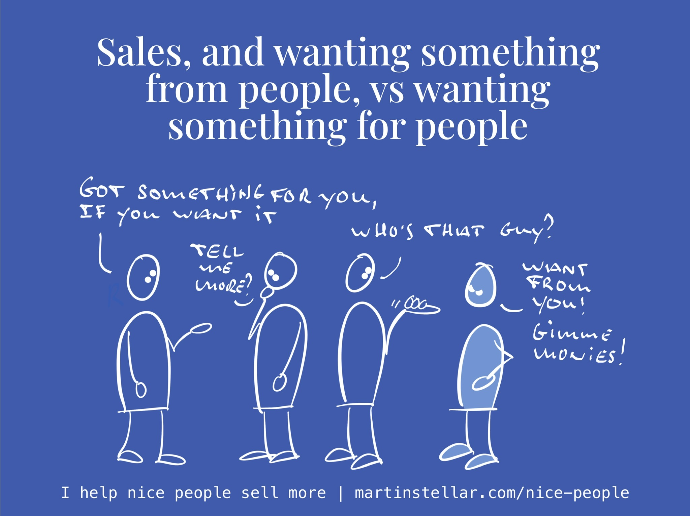

Had a chat with an old friend the other day - one of the guys who used to visit the monastery.

He’s in business too these days, so it was fun to chat and compare notes.

And once again, I had someone tell me “I don’t like selling”.

“I don’t like that the moment you have something for sale, it’s a nasty situation, because it means you want something from people”.

Is that true though?

Me, I’ve got plenty for sale, but I can't say I want anything from anyone.

Instead, I want things *for* people. Not *from* people.

For instance, I want for my readers - hey you! 👋 - to enjoy a daily dose of healthy business & sales thinking.

I want for clients to get the very best of me, and for them to transform their life and their business.

And for potential clients, I want for them to make the best possible decision, whether that means working with me, or not.

Both outcomes are fine by me, so long as the outcome is the best one for the person I happen to be talking to.

So my friend suffers from two problems: the first is the [[📄 Why good eggs should sell more and sleep well at night|good-egg problem]], where the better kind of a person someone is, the more they prevent themselves from getting out there and helping people - i.e. getting their work bought. A very common thing.

The second problem is in his way of thinking, because:

It’s never about getting something from people. Not for people who are in business in order to make things better.

So instead, you make selling about wanting something *for* people. 

This simple change in mindset takes all the awkwardness out of selling, and turns the entire process into a helpful, pleasant way of serving your buyer, by helping them get the clarity they need in order to get to a decision. 

And because of that, your buyers will enroll themselves in wanting what you have, without you having to force or push or convince or persuade. 

