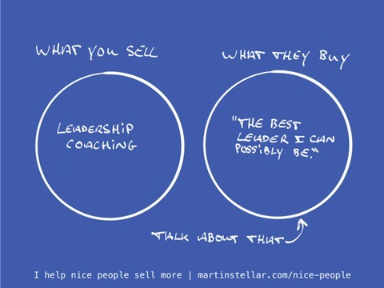

---
tags:
  - Articles
  - Positioning
  - USP
  - Messaging
pubDate: 2024-10-28
type: sfcContent
location: 
cdate: 2024-10-28 Mon
episode: 
imagePath: Media/SalesFlowCoach.app_What-you-sell-vs-what-people-buy_MartinStellar.jpeg
---

You might think that what you sell is consulting, or coaching, or web development or leadership strategy or brand consulting, but that's not what your clients buy. 

This is in line with the old adage 'People don't buy 8mm drill bits - they buy an 8mm hole in the wall'. 

People don't buy a 100% natural Amazonian latex mattress - they buy the best night's sleep you can get. 

Clients aren't looking to buy sales coaching - they're looking to buy an easier time selling, and at better rates. 

And this distinction - the difference between what you sell and [[📄 What's their problem-stack?|what people buy]] - is fundamental if you want to have an easier time selling. 

Because when you're talking about your coaching programme or your consulting services, you're framing the conversation in terms of what you do and bring and provide. 

And while that's all very well and good, it's also what gets you "We'll think about it" and "We'll let you know". 

Whereas if your sales interactions are framed around the outcome that your buyer gets, and what it will do for them and what it will enable or unlock, that's when you create buyer interactions that have people go "Tell me more", and "How does it work?" and "When can we start?"

So before your next sales conversation, your next blog post or social media update, ask yourself:

What is it that I sell?

And what is it, that my buyers are looking to buy?

