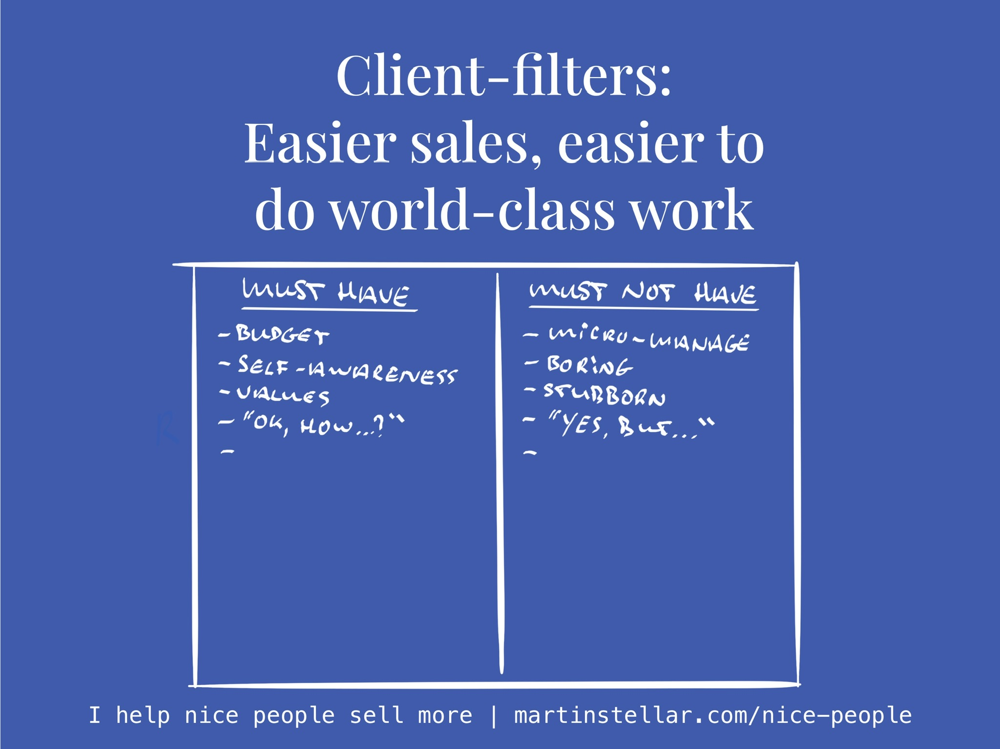

---
tags:
  - Articles
  - ClientFilter
pubDate: 2024-09-10
type: sfcContent
location: 
cdate: 2024-09-10 Tue
episode: 
imagePath: Media/SalesFlowCoach.app_Client-filters_MartinStellar.jpeg
---

Sure, that corporation might have a really costly need and if you were to land the contract, you'd make a really neat profit. 

But landing that contract could mean spending 6 months having meeting after meeting, negotiating with procurement, and updating and rewriting your proposals.

Or that buyer who likes to micro-manage: Yes, maybe the project they need you to do is really cool and totally in your [[📄 What you working on? (Zone of Genius)|Zone of Genius]]... but doing the job means that every day your client writes in to tell you how to do your job, and then you have to spend precious time talking to them or writing carefully worded replies so that you can finally get back to doing your job. 

Or consider the client who keeps changing their mind on what they need from you, and you keep having to discard the work you've done so far, and go back to square one. 

What all these examples have in common is inefficiency in your processes, and even more importantly: 

They all cause you to waste massive amounts of mental real estate, on things that are not relevant to actually doing world-class work for them. 

And your mental real estate - the mind-space in which you do your best thinking and your best work - is scarce, limited, and if you're any good at your work: extremely costly. 

So while there might be all kinds of reasons why you might want a certain job or client, it's important to also consider which type of client you should turn down. 

Because some kinds of client are so costly to serve, that they prevent you from looking for 'better' clients, or from doing world-class work, simply because your mind keeps being pulled back into how to handle or solve the unwanted complications of dealing with them. 

This is why it's important and extremely useful to a create a 'client-filter': a list of must-have and must-not-have attributes, for the clients you engage with. 

It's real simple:
You create two columns on a piece of paper, one titled 'must-have' and one 'must-not-have'.

In column 1 you start listing all the things you love about your clients, the things you want to see in them, and in column 2 all the things that you really really don't want to deal with. 

Once you externalise all these attributes and make them visible on paper, it becomes a client-filter, enabling you to identify the kind of people to avoid at all cost. 

For me, a must-have attribute is 'self-awareness'. No matter how cool the project or how much I like the person: if they can't look in the mirror and own up to their mistakes and flaws, I can't help. 

And a must-not-have attribute for me is: "Yes, but...", because when people say that, it means "No, because...". And you can't coach someone who argues for their own limitations or keeps fighting you. 

Another one is [[📄 Client filter - battle scars required|battle-scars]]: if a buyer is new to business, wether because they're young or they've just left employment and this is their first business, and they're in love with their product, and they haven't been through the school of hard knocks, it's going to be really hard to get them to results, so battle-scars is a must-have for me. 

So what about you? What attributes are required for you, in order to work with a client? Which attributes and traits are there that should make buyers a 'no' for you?

Cheers, 

Martin

P.s. If you are someone who defaults to "Ok, how..." instead of "Yes, but...", and who practices self awareness, and who has had the hard knocks... and you happen to want to land more clients and at better rates, I might be able to help. [Just hit reply](mailto:hello@martinstellar.com), let me know what you need help with, and let's see what we can do together. 