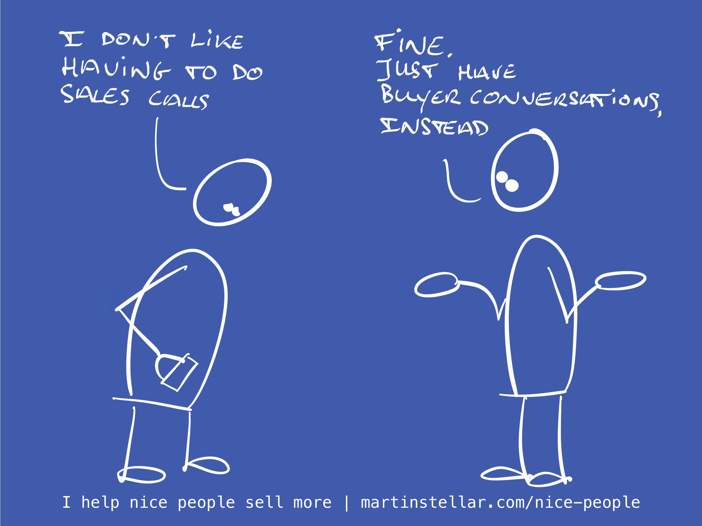

---
tags:
  - Articles
pubDate: 2024-11-19
type: sfcContent
location: 
cdate: 2024-11-19 Tue
episode: 
docType: 
imagePath: Media/SalesFlowCoach.app_What-to-do-if-you-don't-like-having-sales-calls_MartinStellar.jpeg
---

A while ago, an SFNP student said: "I don't mind talking to buyers, but I really don't like the idea of having to have sales conversations".

You might feel that way too, and if so:

Don't. Don't have sales calls.

Instead, have buyer conversations.

After all, that person in your calendar has a problem, has decided to see if you should be the one to solve it, and that means they're a buyer.

And if you follow the principles of [Sales for Nice People](https://martinstellar.com/sales-for-nice-people-info/), all you need to do is simply have [[📄 Permission --> Trust --> Vision --> Decision --> Sale|a conversation that enables them to decide Y/N]].

So, you don't have to have a 'sales call', if that makes you feel like you have to 'do selling to someone'.

Instead, just have a conversation with your buyer, be of service, help them make a decision.

It's a nice thing to do, and it's fun too.

Also fun?

The kind of communicator and business owner you become, once you go through the Sales for Nice People training, [available to you here. ](https://martinstellar.com/sales-for-nice-people-info/)
