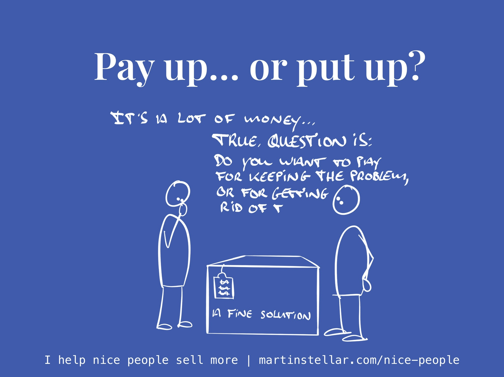

Isn't it just one of the most annoying things?

Everything lines up:

Your buyer needs your work, they like you, they trust you.

They have the budget, there's an eagerness to get started, there's urgency and an actual, true need.

You've even made a proposal, and they like it, and it seems like you're about to land this client... but then, they start hemming and hawing.

“It’s a large investment…”

“Your consulting programme is exactly what we need, but that $30.000 is the budget we’ve set aside for a new site and traffic campaign…”

All valid concerns, of course, but annoying because now your deal is stuck, and you can't just go and [[📄 Pricing yourself out of - and into - a market|lower your rates]].

Whenever you end up in a situation like that, where your price-tag becomes the reason a deal gets stuck, you need to give your buyer the "put up or pay up" message:

"The problem with problems is that we pay for them. Either we pay for keeping the problem, or we pay for getting rid of it. What would make most sense for you at this point?"

And having your buyer make a rational decision about how they're going to pay for the problem is helpful. 

They'll either decide that for now, they're going to keep putting up with it, or they'll decide to pay you and get rid of it. 

Either way you'll have gotten your deal unstuck, and you'll either be working with a new client, or you'll be free to focus on buyers who are fed up with the problem and who are indeed will to pay for a solution. 

Over to you: 

Is your problem that you don't close the sales that you know ought to close? Or is it that you struggle to get paid what your work is worth? 

Because if that's the case, I seriously recommend you consider Sales for Nice People. 

Not only does it make the sales process easier, it also teaches you how to avoid stuck deals, how to get the money you deserve, it helps you avoid getting ghosted, and it enables you to earn more and create a bigger impact. 

Question is: if those are goals you have but the problem is that your selling isn't working...

Is it [time to pay for the solution](https://martinstellar.com/sales-for-nice-people-info/), or are you going to keep putting up with it?

