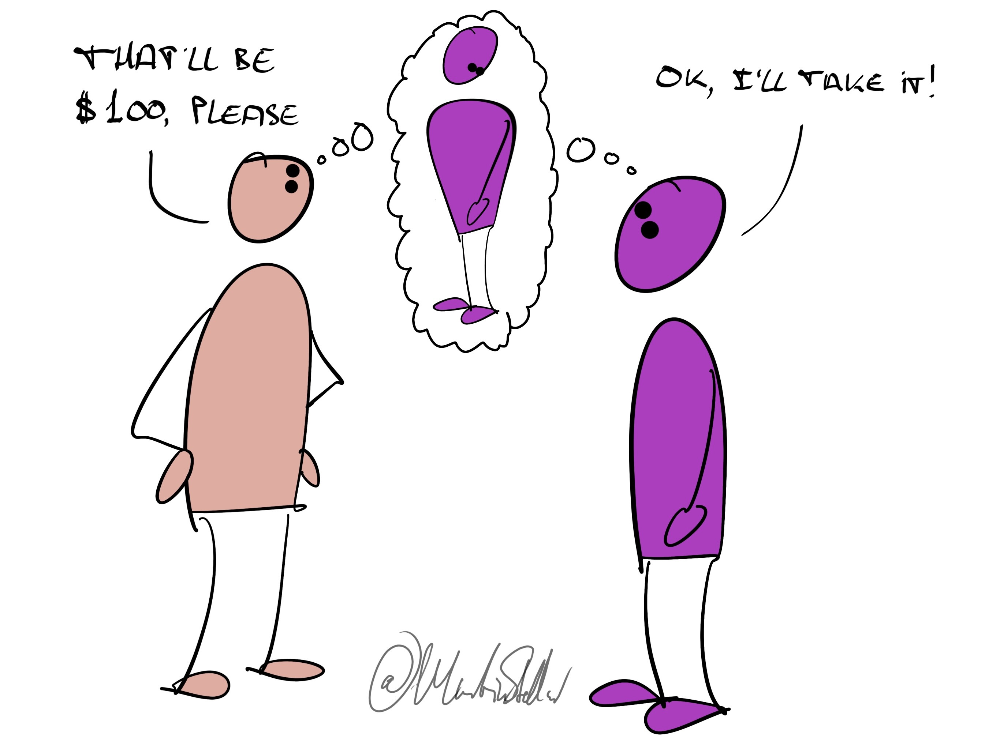

---
tags:
  - Articles
pubDate: 2024-11-18
type: sfcContent
location: 
cdate: 2024-11-18 Mon
episode: 
imagePath: Media/SalesFlowCoach.app_Purchase-motivators-the-identity-piece_MartinStellar.jpeg
---

It's one thing to buy a solution to a problem, but it's an entirely different game to become the person who managed to solve a problem.

For you in selling your coaching or consulting services, this matters a lot.

Because if all you offer your buyer is 'a programme that finally gets rid of pesky problem XYZ', your buyer will perceive you as just another commodity, another vendor trying to close a sale.

But, if you focus your sales conversation on what will change in the way that buyer sees themselves, and how it will change the way people in their world see them, now you're having a conversation about the single most important thing in that person's life: they themselves.

(And yes, even magnificently altruistic people who live their life in service of others have the self as their prime concern. How could they not? Without a self in good working order, there's no serving others.)

So, when you are dealing with a buyer, you get to make a choice:

Either you offer your buyer a solution with its attached value...

Or, [[📄 When they object or resist... is it because you're selling them an identity they don't want?|you sell them a new identity]], a new version of themselves, an upgrade to who they used to be.

Your buyer goes from 'me, now', to 'the new me, who finally decided to get rid of the problem once and for all'.

And in doing so, they acquire a new identity.

So the question you need to be asking yourself when dealing with a buyer is always "Who are they looking to become? What is the new version of themselves, that they are looking to acquire, when they buy my solution?"

And yes, you can even ask that directly of your buyers:

"If you were to buy my solution, and it would cause you to get rid of the problem, how would that change you? What do you stand to win? In what way would your team, your peers, your family, see you in a different light?"

Talk with your buyer about that, and you'll find they negotiate with themselves in favour of buying.

And yes, you learn how to have that kind of conversation in the Sales for Nice People training, and, bonus:

You won't have to become a sleazy scuzzbag who manipulates buyers.

You'll simply become a person who asks far better questions, who is far more at ease with selling, all while [[📄 Lead With Values and Sell More Because of Them|keeping your values intact]] (and your sales and revenue rising).

[Access the programme here.](https://martinstellar.com/sales-for-nice-people-info/)