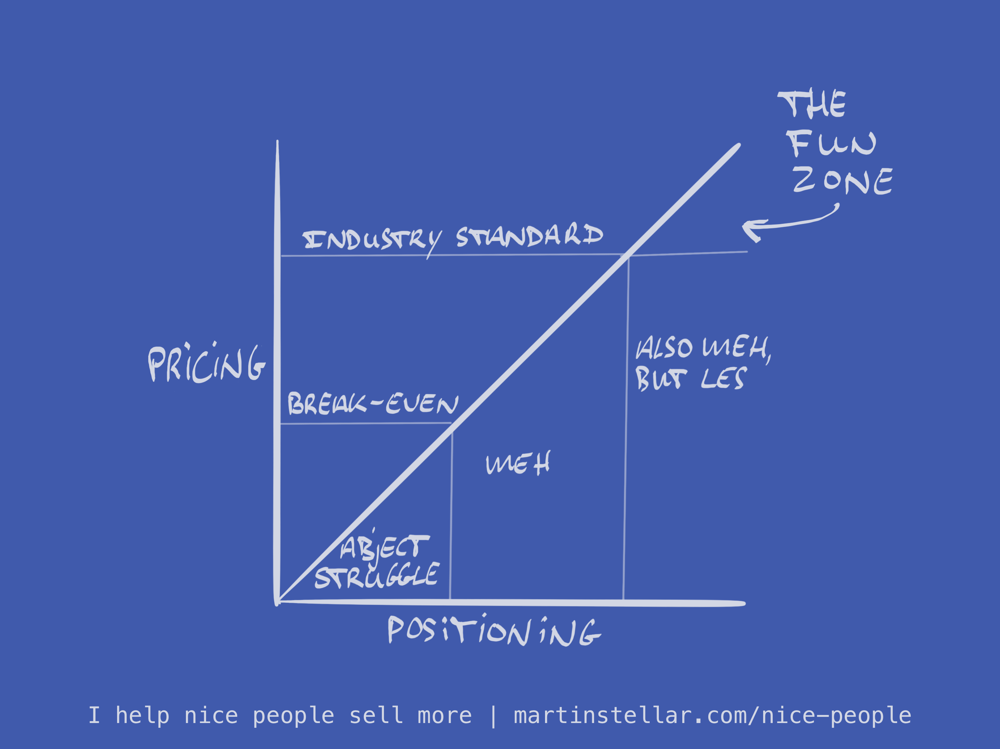

"So why $8000?", I ask him. "If you're going to raise your rates, why that number? Why not $10,000?"

"Well", he tells me, "Industry standards are..."

And that's where it's easy to miss out on profit and growth.

Because 'industry standards' is just another way of saying 'An earning ceiling that your competitors haven't been able to break through'. (Also see: [[📄 "But if I charge what I'm worth, people won't buy!"]])

And I sure wouldn't want to be locked into that world and pricing level, and that's why I don't give a damn what industry standard pricing is for the kind of coaching and consulting I do.

Instead, I base my pricing on the size of the problem I like to solve for my clients.

And I like working on million-dollar problems when I do intensive 1 on 1 programmes with clients, so that comes at a high price.

Of course that means I hear "No", a lot, but then again: I used to hear that a lot as well when I was cheaper, simply because not every buyer buys. But it sure feels a lot nice to hear "No" to a $10 offer, than to a $1 offer.

Another benefit of high prices is that it puts you in a market with far less competition. 

And let me tell you: it's much nicer to compete with people who earn a lot, than with people who struggle because they use competitive pricing or give massive discounts.

And it's great for positioning too. When your prices are above average, you're taking a powerful stand. It's authority-positioning, and that means people will treat you with more respect, whereas competitive pricing relegates you to the status of just another provider whose proposal has to be compared against others, and the next thing you know you get pushback on pricing or your buyer starts haggling. 

So where it comes to your pricing, how do you stack up against the competition?

Do you tend to limit yourself to industry-standards?

Because if you do, and you want to break through that ceiling, and you want to earn what *you* decide your work is worth, instead of what your industry considers the norm, you'll find my book very helpful. 

Especially the chapter on Price, but actually the entire section on Profit, will give you a nicely radical upgrade in terms of how you think about what you could, and ought to, get paid for your work. 

As for that book and it being available: we're cracking on, yesterday I was on-site in Malaga so I couldn't do anything on it, but today I'm back at trying to finish and publish it. 

TBC, and y[ou can still get on the launch list](https://martinstellar.com/book) and get instructions on how to get a free copy.
