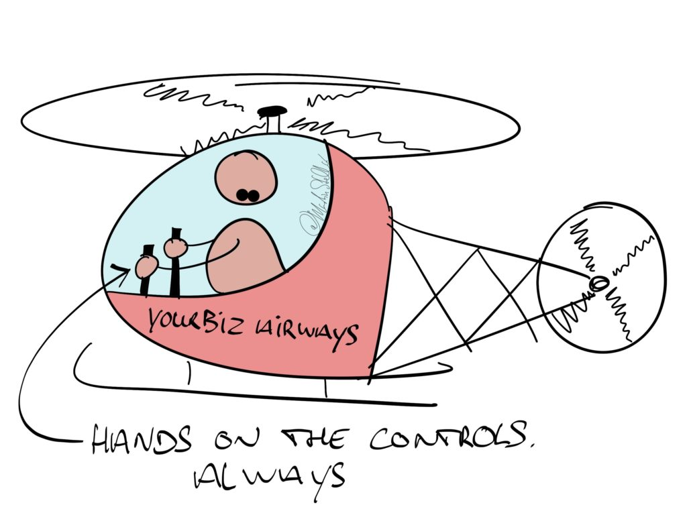

It might look like others have it figured out, but I promise: almost nobody has.

We see the successful people, those who inspire us, and cause us to aspire, and we think:

“Once I have what they have (either in place, or in possession), then things will be different! Easier! More profitable!"

And yes, that might be true. But not because by then you’ll have ‘figured it out’.

Not in business, that’s not how it works.

The thing to remember is that a business is like a helicopter: it's inherently unstable.

The moment you take your hands off the controls, a helicopter will start to spin out of control - that’s what you get with two rotors operating in different planes, each producing lift, thrust, and torque. A plane can glide if you leave it be, but all a chopper can do is fall.

And business is equally unstable - it's fundamentally Volatile, Unstable, Complex and Ambiguous.

Does this mean that building a business will always be a struggle?

Well no. Once you become a skilled pilot and you become a skilled pilot, you’ll know which buttons to push, which valves to open or close and which levers to push or pull.

And most importantly, you’ll know to never, ever, take your hands off the controls.

The moment you do, unpredictability sets in, and you’ll start to lose control.

Having things figured out, running, working, is good - but, you can't afford to think things will run on autopilot now.

Whether it's you or a delegate, keep hands on controls at all times.