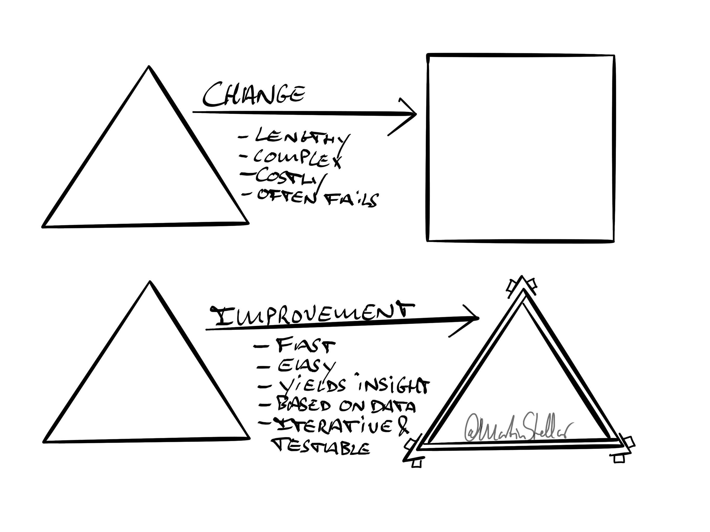

---
tags:
  - Articles
  - BusinessFundamentals
  - Growth
pubDate: 2024-04-02
type: sfcContent
location: 
cdate: 2024-04-02 Tue
imagePath: Media/SalesFlowCoach.app_Change-vs-improve_MartinStellar.jpg
---

When your website isn't getting you subscribers, do you need a new website - or should you A/B test your signup page?

If email marketing used to work for you but it no longer does... should you switch over to social media marketing, or does it make more sense to find out what broke, and fix it?

When people aren't buying your work, should you redesign your product portfolio and introduce new offers... or should you analyse whether or not there's even a match between what you're offering, and who you're offering it to?

Most people will agree that for each example, improving things makes a lot more sense than wholesale changing or replacing things.

Except many, many businesses make a mistake, and do the opposite.

Sales stalled? Restructure the company!

Landing pages no longer converting? We need a new website!

No engagement from your buyers? Let's pivot our business model!

Sure, changes like that might work.

But very often, the change is instigated as a way to 'fix everything', and even worse: it's often done based on 'great ideas', and not on actual data, intel, and insight.

And then you go into a long, complex, costly process of change... which, very often, turns out to not really fix what you wanted to fix. **And** you spent 3 months on it, all for almost nothing. Oops.

Of course it's tempting: change is refreshing, and promising, and spending time in the 'zone of novelty' feels terrific, as does tinkering away at that big change-project that's meant to solve all your problems.

But very - VERY - often, what's required for growth is not change, but improvement.

If your sales aren't happening, should you hire new salespeople... or should you analyse their calls and meetings? Would it make more sense to interview buyers, and find out why they said 'yes' but did 'no'?

Change can work.

But don't make the mistake of changing something that's kinda working, without first figuring out in what way it could be improved.

This philosophy - improving sub-optimal performance instead of replacing it - is at the heart of the Hidden Sales Assets methodology.

Instead of letting a gut-instinct and a frustration with results cause you to throw out the baby with the bathwater, the systems analyses what works, what doesn't, and what should be improved.

And, it does that by going back to the basics of the most fundamental question in business:

How do you repeatedly and reliably find strangers, and turn them into customers?

The answer to that is, at the heart of it, extremely simple, and hinges on four fundamental questions:

1: Why should people buy from us, and not our competitor? I.e. [[👨‍🎓 SIBG Pt. 1.2 - How to define your value proposition, aka USP|what is our USP]], our distinguishing and unique quality?

2: Who is the perfect candidate for our work - who needs us, can afford us, has urgency, and gets us?

3: What problem does that person - and everyone like them - most need solving - i.e. [[📄 Hidden Sales Assets 3 - Your ideal buyer's Problem-stack|what's their problem-stack]]?

4: In what way should we communicate with them, so that they realise our solution is right for them... meaning, what messaging will work for those people?

Answer those questions, and you'll be able to improve all manner of things, from your sales copy to your call scripts to your About page and your product brochure. No drastic change required.

And how do you answer those questions?

Well, a good place to start is following the steps outlined in the Hidden Sales Assets implementation plan, which I'll share with you shortly.
