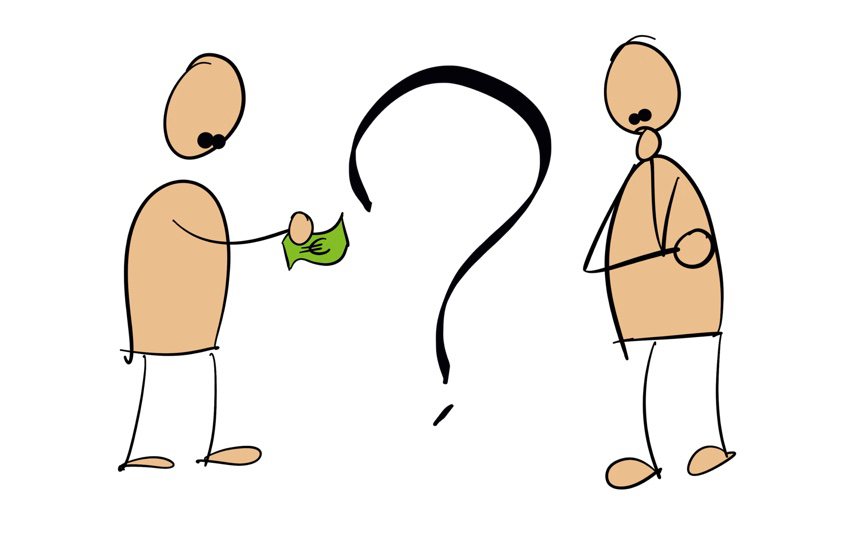

How well do you know why people do business with you, and not with someone else?

In other words: Do you know why, actually, people give you money?

You might answer:

"Because we're the best", or:

"Because of our customer service", or:

"Because we're an award-winning agency".

But unless you've done your homework and the answer is what your customers themselves have told you, you're probably mistaken - or at the very least, you'll have an incomplete picture.

Put differently: your [[👨‍🎓 SIBG Pt. 1.2 - How to define your value proposition, aka USP|Unique Selling Proposition]] is what your buyers tell you, not what you yourself might think.

If you want to grow your company, then you can't afford to go with what you *think* your people think of you.

You need to get out there and talk to them, and figure out their actual reasons, and not the reasons you think they have.

That's how you figure out your USP.

It's called market research, and it's the very first thing you should do, if you want more customers like the ones you have & love.

We all know this, yet hardly anyone does it.

So we throw more money at ads.

Hire more sales reps, create more offers, build more websites, do more content marketing.

But this way, we cause an enormous levy on resources, and we don't even know the horse's-mouth facts, about *why* people pay you.

It's a losing proposition.

So, get the foundation in place first:

Find out from your people why they choose you, and not someone else.

Then build up and out, based on that insight.

Because how does it make sense to spend resources, when you don't even know your differentiator yet - your USP - when you don't know what sets you apart and makes you desireable, *in the eyes of your buyers?*

Know your differentiator.

Not in terms of what you think is your differentiator - but in terms of what they tell you it is.

Talk to your buyers, and simply ask:

Why did you choose us, and not someone else?

Note: The what and how of figuring out your USP is step 1.2 in the mini-training [[👨‍🎓 Mini-training - Introduction to Stages & Ingredients of Business Growth (SIBG) Pt. 0.0|Stages and Ingredients of Business Growth]], available to you right here inside the SalesFlow Coach app - check it out!

Or, if you want to get my help:

Discovering your USP is a core component of the Hidden Sales Assets system (The other three are Client Avatar, Problem-stack, and Messaging) and you can get yourself a 1-hour Breakthrough Session, to give you more clarity on who to speak with, who to ignore, and what messaging to use in order to get them to buy from you. [More information and access here.](https://martinstellar.com/salesbreakthroughsession/)
