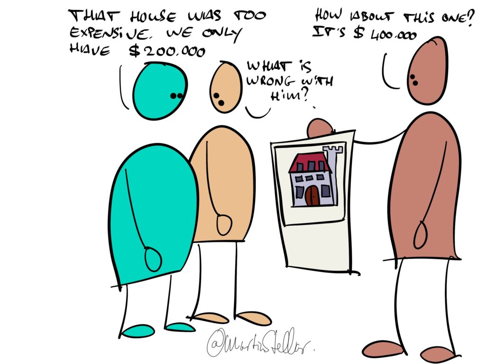

"We didn’t like that estate agent”, she says. "He kept showing us properties that were above our budget - and like, $200K over budget. It was weird”.

A dinner conversation, over at a friend's house.

“It bit him in the ass though, because in the end we bought a property through a different agent.

"And as it turns out, Mr. Greedy Agent also had that place in his portfolio - but because he never showed it to us, we bought it through someone else”.

And so it is with selling: if you try too hard, if there’s neediness, if there’s greed, it’ll backfire.

It’s quite the opposite to my friend Dick, who’s one of the top sellers in his real estate agency.

His secret? “I sell people the house they want, and make sure they don’t buy the wrong house”.

That’s ethics in selling. It’s looking out for your buyers, and it’s a perfect way to do very well indeed.

Good eggs sell more, and they sleep better - at least, that's how it should be.

[[📄 On selling, entitlement, and service|When you’re an ethical person]], with a lot of integrity, you'd be mistaken to think that such character traits make selling (or enrolling buyers) harder - it doesn’t have to be that way, and in fact:

If you know your values and you lead with integrity, it makes selling a hell of a lot easier, and a lot more fun too.

To learn how to sell more because of your values, not despite them, feel free to [click this link and apply for the Sales for Nice People training](https://martinstellar.com/sales-for-nice-people-info/).